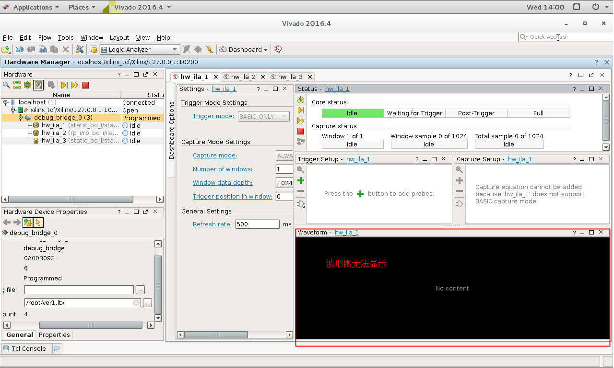
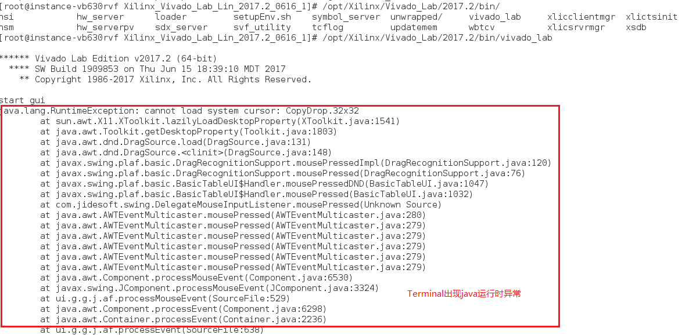
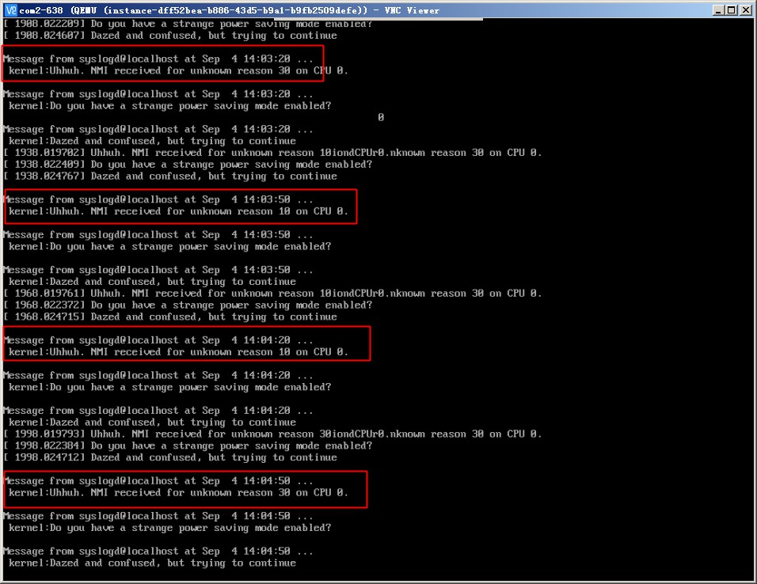
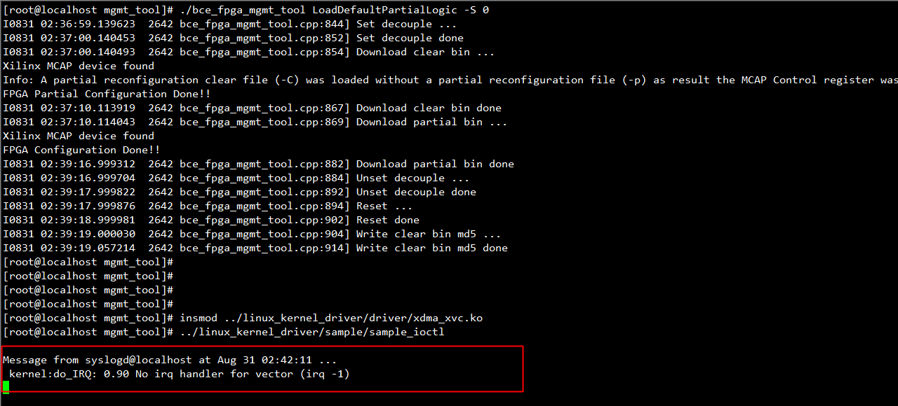

* **Q: 如图，经百度云控制台webvnc登录桌面环境后，vivado调试时波形图不能正确显示，并可见java运行时异常，该如何解决？**

  * A: 出现此现象的原因可能是vivado某些显示功能和百度云webvnc存在冲突，可通过自行在虚拟机实例内安装vnc服务以获取桌面环境绕过，具体步骤如下。第一步，执行`sudo yum -y install tigervnc-server`安装vnc服务器；第二步，执行`vncserver -geometry 1920x1080`启动一个X DISPLAY，此处分辨率可按需调整，另注意首次启动时需要设置vnc密码；第三步，购买一个EIP（公网IP）；第四步，在本地vnc客户端（如vnc viewer）通过EIP+端口号（首个X DISPLAY一般为5901）连接虚拟机实例内的vnc服务器获取桌面环境；第五步，启动vivado进行波形图调试。

* **Q: webvnc的屏幕太小，影响开发调试体验，该如何解决？**

  * A: 同上一问题回答，可通过自行在虚拟机实例内安装vnc服务以获取桌面环境绕过。第二步中启动X DISPLAY时可以自行设置分辨率。

* **Q: 如图，虚拟机实例内间歇性提示收到NMI（Non-Maskable Interrupt），刷新终端显示，该如何解决？**

  * A: 出现此现象的根本原因是低版本qemu对ICH9芯片的行为模拟有偏差，百度云后续的qemu升级计划可以彻底解决该问题。目前，您可以在虚拟机实例内通过禁用`iTCO_wdt`模块来绕过，具体步骤如下。第一步，执行`sudo echo -e "blacklist iTCO_wdt\nblacklist iTCO_vendor_support" >> /etc/modprobe.d/blacklist.conf`更新模块加载黑名单配置文件；第二步，关闭虚拟机后重新开机即可。

* **Q: 如图，加载驱动后提示`kernel:do_IRQ: *** No irq handler for vector (irq -1)`，该如何解决？**

  * A: 出现此现象的根本原因是2.6.32版本Linux内核对MSI-X中断的支持不完善，换用3.10版本的Linux内核（虚拟机实例初始自带内核或默认yum源中内核均满足要求）即可。

