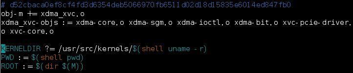
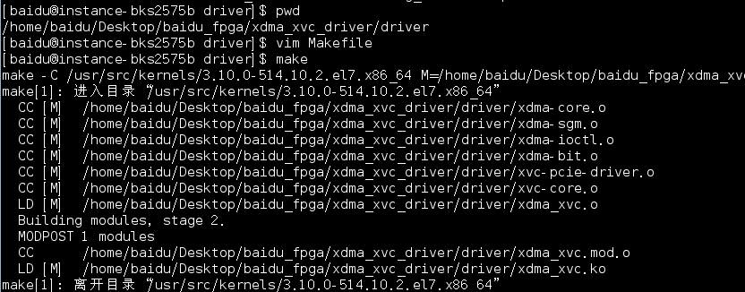
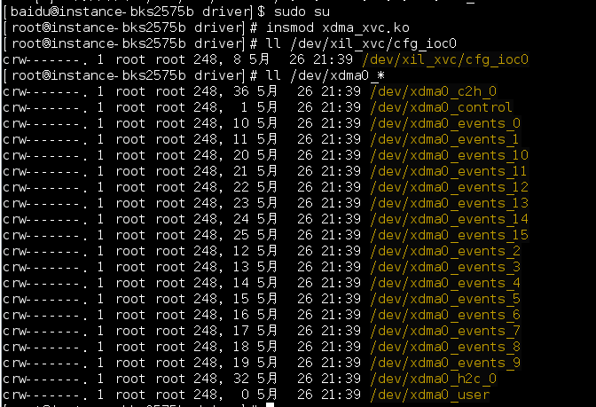
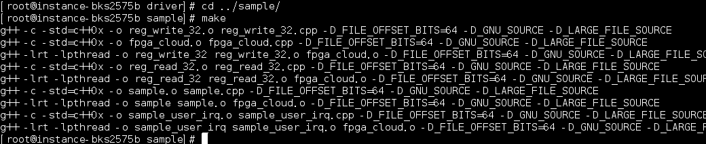
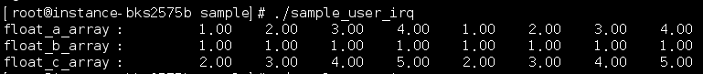
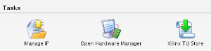
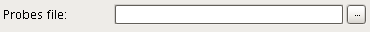

百度FPGA云服务器提供的FPGA标准开发环境镜像中，包含了一个demo工程的所有设计文件，您可以按照本说明文档列出的步骤，逐步操作完成一个fpga demo工程的制作流程，并将制作好的镜像加载到fpga中，通过测试程序验证demo工程的功能。

# 0.登录镜像

用户使用创建实例时预设定的密码或重置后的密码登录root账户后，在shell中输入
```bash
$ passwd baidu
```
按提示修改baidu账户的密码，然后用baidu账户重新登录。下文所示路径均以baidu账户的HOME目录为基准。后续步骤中如提示权限不足或`Operation not permitted`，请在命令前加sudo重新执行。

# 1.制作FPGA镜像

登入创建好的的虚拟机之后，首先进入开发工具包的build脚本目录

```bash
$ cd ~/hdk/baidu_hw_design_toolkit/prj_vectoradd_ram/build/
```

在这里执行build脚本，就开始了制作demo工程的FPGA镜像的流程，执行过程的输出记录在nohup.out之中

```bash
$ vivado -mode batch -source run_IPI.tcl > nohup.out 2>&1 &
```

大约等待1个小时左右完成FPGA镜像的制作过程，可以检查nohup.out的输出结果

```bash
$ cat ~/hdk/baidu_hw_design_toolkit/prj_vectoradd_ram/build/nohup.out
```

如果最后一行如下所示，则表明制作FPGA镜像的过程结束。

```bash
INFO: [Common 17-206] Exiting Vivado at ……
```

请打开my_top_pr_verify.log日志文件，确认生成的FPGA镜像合法

```bash
$ cat ~/hdk/baidu_hw_design_toolkit/prj_vectoradd_ram/build/projDir/Bitstreams/my_top_pr_verify.log
```

显示的该文件的倒数第二行应该如下所示

```bash
INFO: [Vivado 12-3253] PR_VERIFY: check points ../common_files/static_fix_dcp/my_top_route_design.dcp and ./projDir/Implement/ver2/my_top_route_design.dcp are compatible
```

# 2.加载驱动

修改driver/Makefile中的KERNELDIR变量，使之指向当前内核的编译目录，一般为/lib/modules/$(uname -r)/build目录或/usr/src/kernels/$(uname -r)。

```bash
$ vi ~/sdk/linux_kernel_driver/driver/Makefile
```

  

执行make，如果编译成功，当前目录下会生成xdma_xvc.ko驱动文件，如下图所示。

```bash
$ make
```

  

执行insmod xdma_xvc.ko，装载上一步生成的驱动文件。

如在/dev目录下出现如下设备文件/dev/xil_xvc/cfg_ioc0和/dev/xdma0_*c，则确认驱动加载成功。

```bash
$ sudo insmod xdma_xvc.ko
$ ll /dev/xil_xvc/cfg_ioc0
$ ll /dev/xdma0_*
```

  

# 3.加载FPGA镜像

在sdk/mgmt_tool目录下，含有加载新生成的FPGA镜像的必要工具。执行方式如下

```bash

$ cd ~/sdk/mgmt_tool
$ ./bce_fpga_mgmt_tool LoadPartialLogic -S 0 -P ../../hdk/baidu_hw_design_toolkit/prj_vectoradd_ram/build/projDir/Bitstreams/ver2/ver2_pr_region_partial.bin

```

# 4.编译&执行测试程序

进入sample目录，执行make。如果编译成功，当前目录下生成sample_vectoradd_ddr等可执行文件，如下图所示。

```bash
$ cd ~/sdk/linux_kernel_driver/sample
$ make
```

  

执行sudo ./sample_vectoradd_ddr，输出如下结果，PE正确地执行了浮点向量加功能。sample_vectoradd_ddr使用中断方式检查命令结果是否完成。

```bash
sudo ./sample_vectoradd_ddr
```

  
s
# 5.调试FPGA镜像


进入xvc_server工具包，该工具包用于支持vivado工具使用虚拟jtag；运行工具包内的工具如下：
如果是第一次执行，需要编译工具，操作如下：
```bash
$ cd ~/hdk/xvc_server
$ make
```
启动xvc_pcie程序，执行如下命令
```bash
$ cd ~/hdk/xvc_server
$ sudo ./bin/xvc_pcie
```

程序会在前台保持运行，您当前看不到任何输出，是正常的。

请登录vnc打开vivado工具，打开vivado工具后，点击Open Hardware Manager

  

在console中输入： 

```bash 
$connect_hw_server  
$open_hw_target -xvc_url 127.0.0.1:10200
```

您可以看到在Hardware窗口下可以看到设备，名为debug_bridge

  

点击debug_bridge后，可以在属性窗口，找到probes file一行：

  

点击右侧的浏览按钮，选择您需要的probe file。点击OK

您可以在如下路径找到您需要的probe file文件：

路径是您开发动态逻辑时使用的~/hdk/baidu_HW_design_toolkit/prj_vectoradd_ram/build/projDir/Bitstreams/ver2/ver2_rp_bd_i_partial.ltx

  

在设备上右键选择refresh device

  

至此您可以像平时使用Vivado工具一样用您工程中的ila和vio进行功能调试和信号查看。

  