本页面将介绍基于IP Integrator的方式修改demo工程，为其添加DDR控制器的过程。您可以从中学习  
* 为FPGA云服务镜像添加ddr控制器的具体步骤
* 利用IPI修改demo工程中rp_bd block design的一个范例

1.打开demoPrj工程的rp_bd block design。此时界面如下图所示

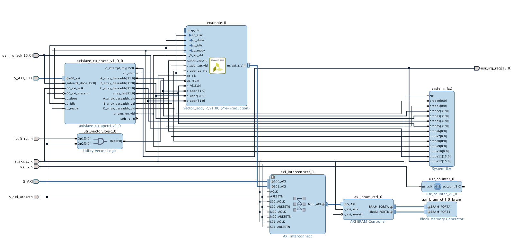  

如果您曾经跑过完整的产生FPGA云服务镜像IPI流程，则可以用vivado打开`Baidu_HW_design_toolkit/prj_vectoradd_ram/build/projDir/myproj.xpr`，然后双击rp_bd block design即可。  
如果您还没有运行过产生FPGA云服务镜像IPI流程，可以执行如下脚本
```bash
$ cd ~/Desktop/baidu_fpga/baidu_hw_design_toolkit/prj_vectoradd_ram/build/
$ vivado -mode batch -source ./scripts/build_rp_bd.tcl
```
执行完成后可以用vivado打开`Baidu_HW_design_toolkit/prj_vectoradd_ram/build/tempDir/myproj.xpr`，然后双击rp_bd block design即可。   

2.删除axi_bram_ctrl_0和axi_bram_ctrl_0_bram，删除方法：选中模块按delete键即可。此时如下图所示

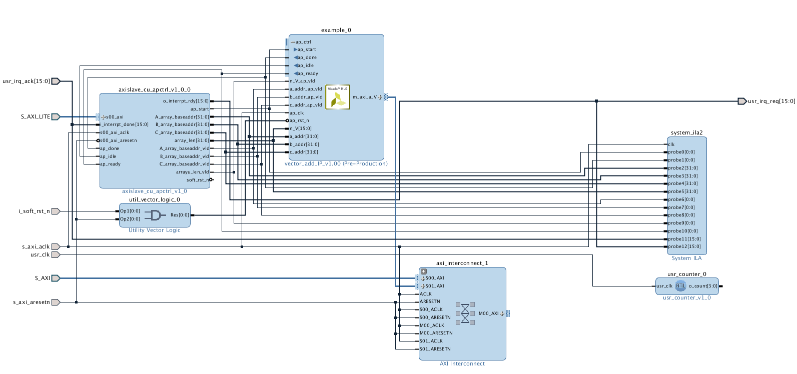  

3.右键点击axi_interrconnect_1.M00_ACLK接口，选择Disconnect Pin。之后再右键点击axi_interrconnect_1.M00_ACLK接口，选择Make External。

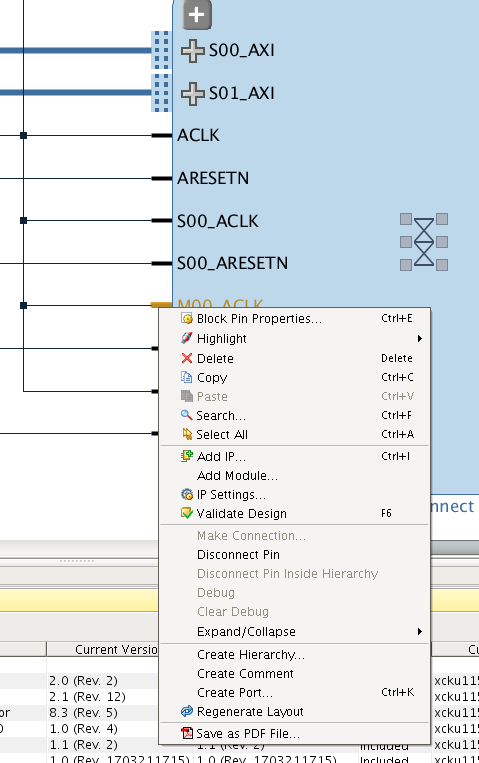  

4.点击新创建的port，如下图修改其名字属性和频率属性

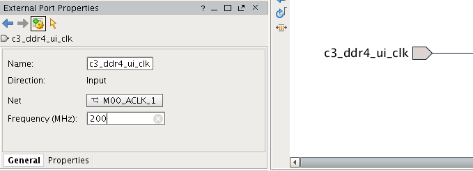  

5.右键点击axi_interrconnect_1.M00_ARESETN接口，选择Disconnect Pin。

6.点击左侧工具栏的Add IP按钮，添加Utility vector logic IP。

7.配置新创建的IP的属性，C_SIZE为1，C_operation为not，也就是做一个非门。

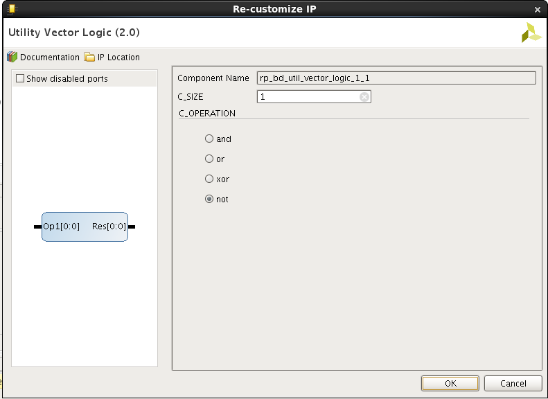  

8.连接新创建的非门的res和axi_interrconnect_1.M00_ARESETN接口。

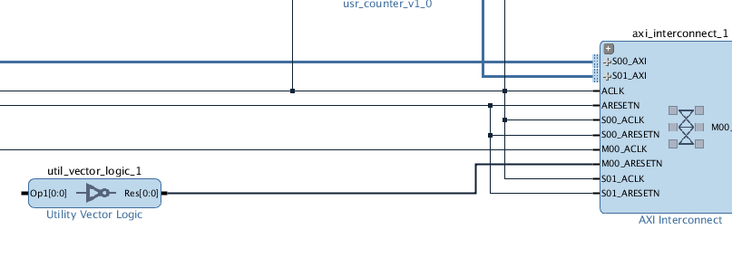  

9.右键点击create port，按照下图填写弹出的port属性对话框

  

10.点击新创建的port，确认其名字属性，时钟域属性和极性属性与下图一致

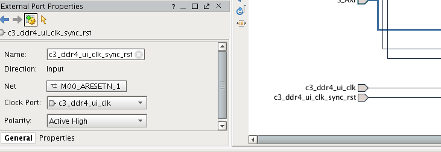  

11.连接c3_ddr4_ui_clk_sync_rst和非门的op输入

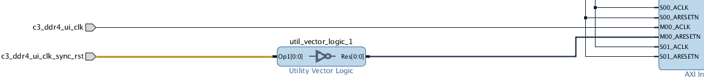  

12.右键点击axi_interrconnect_1.M00_AXI接口，选择Make External

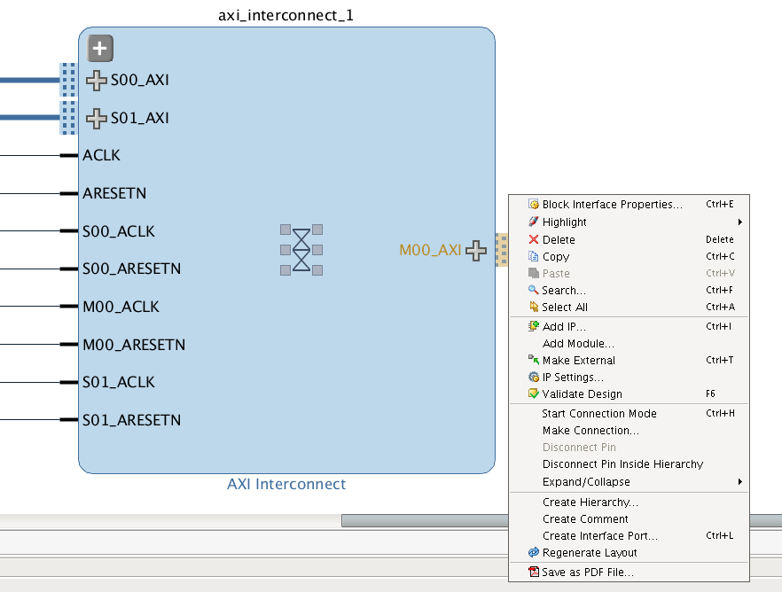  

13.选中M00_AXI port，在接口属性对话框中修改其名字属性为C3_DDR4_M_AXI，时钟域属性改为c3_dd4_ui_clk

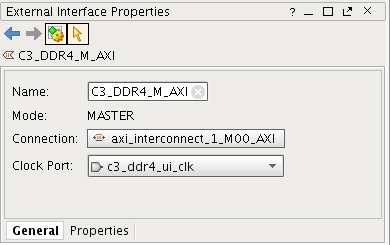 

14.双击C3_DDR4_M_AXI port，如下图所示修改data width为512，addr width为31。

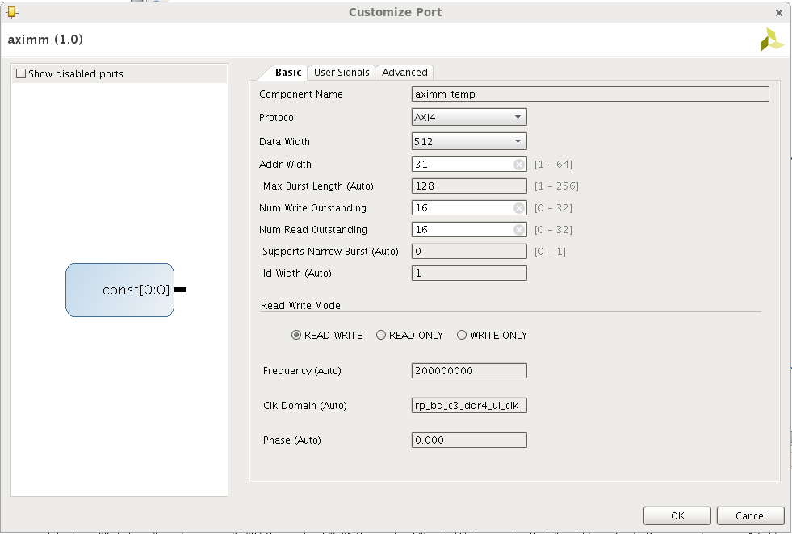 

15.在address editor为新创建的port分配地址空间，如下所示

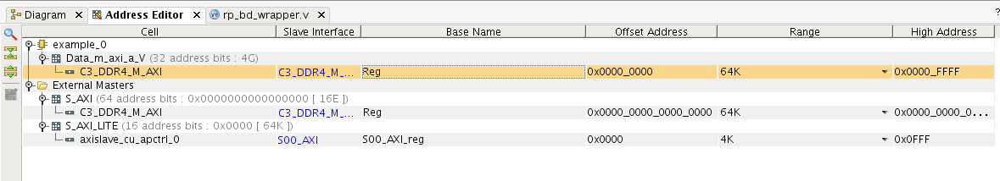 

16.点击左侧工具栏 validate design按钮，确认当前block design设计无误。此时block design如下图所示

 

17.在console执行write_bd_tcl -force -no_ip_version ./Baidu_HW_design_toolkit/build/scripts/rp_bd.tcl命令

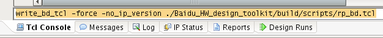 

18.修改Baidu_HW_design_toolkit/build/scripts/step_00_setup.tcl的41~44行如下图所示。

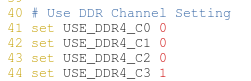 

19.完成修改，执行run_IPI脚本，产生FPGA云服务镜像

额外说明：  
本页面对rp_bd所做的修改，只是将rp_bd访问内部block ram的请求转移到访问外部DDR，所以demoPrj的软件不需要做修改。  
C0~C3是FPGA云服务器提供的4个可用的DDR通道，上述说明中，将C3改成Cx即可采用其他的DDR通道。  
您的rp_bd逻辑也可以采用同样的方法，使用多个DDR通道，只需保证step_00_setup脚本和rp_bd一致即可。  