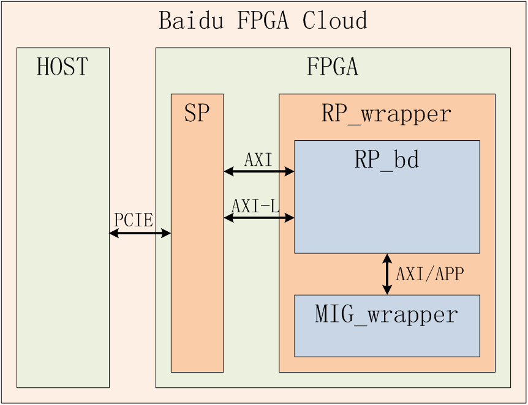
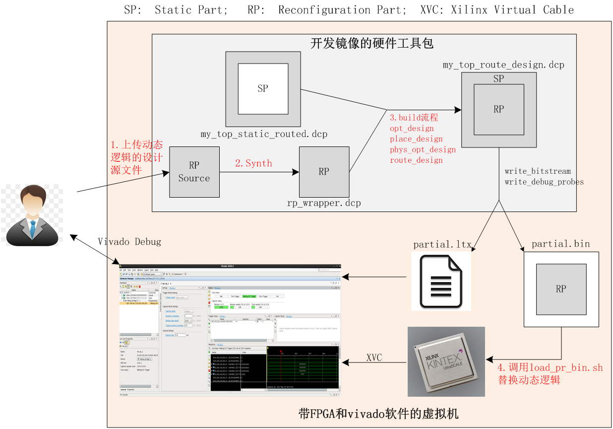

# 1.FPGA云镜像工程总体框架
FPGA云镜像工程的总体框架如下图所示，FPGA逻辑包含了静态和动态两部分。

静态部分SP提供了pcie xdma，基于pcie的debug模块，flash控制器等。静态部分的逻辑不暴露给用户，用户不能修改也不用关心静态部分的逻辑。

动态部分（RP_wrapper）可由用户自定义生成，包含了RP_bd和一些支撑模块如MIG_wrapper和debug bridge(图中没画出来)。我们建议用户不要修改RP_wrapper中的支撑模块，只实现RP_bd模块即可。如果RP_bd的逻辑不需要DDR，可在build/scripts/step_00_setup.tcl中关闭所有的DDR通道，FPGA云镜像工程在build环节就不会生成DDR控制器占用逻辑资源。

SP与RP_bd之间包含2个256Bit的AXI4总线和一个32bit的AXI-lite总线，其中AXI_rp_slave和AXI-lite总线的master端位于SP，slave端在RP_bd。AXI_rp_master总线的master端位于RP_bd，slave端在SP。

 - AXI_rp_slave是xdma输出的总线，host发出的dma操作，所需访问card空间的读写请求会出现在该总线上。 
 - AXI-lite的地址范围是64KB，host访问bar0空间64KB ~ 128KB的地址范围的请求会出现在该总线上。 
 - AXI_rp_master给RP_bd提供了发起AXI请求的接口，动态逻辑可实现主动的h2c和c2h的DMA请求，而无需host端软件发起。

# 2.RP_bd模块的接口
在制作FPGA云服务镜像时，您开发的逻辑就是RP_wrapper中的RP_bd模块。这意味着用户逻辑的顶层模块，接口名称和信号位宽需与RP_bd模块保持一致。下表总结了RP_bd模块的所有接口信号。

名称 | 方向 | 功能说明
----| ---- |----
M_AXI_*	| Master	| 256bit的axi4总线，支持由卡上逻辑发起AXI操作，可用于动态逻辑与主机之间交换批量数据。
S_AXI_*	| Slave	| 256bit的axi4总线，支持xdma的dma操作，可用于动态逻辑与主机之间交换批量数据。
S_AXI_LITE_* 	| 	Slave	| 	32bit的axi lite总线，支持xdma的reg操作，可用于动态逻辑与主机之间传输配置命令。这段空间在bar上的偏移地址为64K ~ 128K。用户可以通过在软件侧读写地址为64K~128K之间的寄存器来访问该AXI_LITE总线上的设备。
s_axi_aclk	| 	input	| 	两个AXI总线的工作时钟，250M。
s_axi_aresetn	| 	input	| 	两个AXI总线的复位信号，低有效。下面提到的i_soft_rst_n信号也可以触发s_axi_aresetn信号，也就是说：用户可以通过在执行写寄存器操作触发下述i_soft_rst_n复位信号从而触发s_axi_aresetn，持续时间与i_soft_rst_n相同。
i_soft_rst_n	| 	input	| 	static bd输出给RP_bd的软复位信号，低有效，持续32个axi clk cycle。用户可以通过在软件工具包中写地址为16的寄存器来触发该复位信号。
usr_clk	| 	input	| 	100M的工作时钟。
usr_clk_rst	| 	input	| 	100M工作时钟的同步复位信号，高有效。
usr_irq_ack[15:0]	| 	input		| 用户中断的响应信号。
usr_irq_req[15:0]	| 	output		| 用户中断的请求信号。
C0_DDR4_M_AXI_*	| Master		| 512bit的axi4总线，连接DDR C0通道，可用于动态逻辑与DDR之间传输数据。如果RP_bd使用了该接口，需在build/scripts/step_00_setup.tcl中定义USE_DDR4_C0为1，且USE_AXI_DDR为1。
c0_ddr4_app_*	| Master		| 512bit的mig app总线，连接DDR C0通道，可用于动态逻辑与DDR之间传输数据。如果RP_bd使用了该接口，需在build/scripts/step_00_setup.tcl中定义USE_DDR4_C0为1，且USE_AXI_DDR为0。
c0_ddr4_ui_clk		| input		| C0_DDR4_M_AXI_*的工作时钟，300M。如果RP_bd使用了该接口，需在build/scripts/step_00_setup.tcl中定义USE_DDR4_C0为1。
c0_ddr4_ui_clk_sync_rst		| input		| C0_DDR4_M_AXI_*的复位信号，高有效。如果RP_bd使用了该接口，需在build/scripts/step_00_setup.tcl中定义USE_DDR4_C0为1。
C1_DDR4_M_AXI_*		| Master		| 512bit的axi4总线，连接DDR C1通道，可用于动态逻辑与DDR之间传输数据。如果RP_bd使用了该接口，需在build/scripts/step_00_setup.tcl中定义USE_DDR4_C1为1，且USE_AXI_DDR为1。
c1_ddr4_app_*	| Master		| 512bit的mig app总线，连接DDR C1通道，可用于动态逻辑与DDR之间传输数据。如果RP_bd使用了该接口，需在build/scripts/step_00_setup.tcl中定义USE_DDR4_C1为1，且USE_AXI_DDR为0。
c1_ddr4_ui_clk		| input		| C1_DDR4_M_AXI_*的工作时钟，300M。如果RP_bd使用了该接口，需在build/scripts/step_00_setup.tcl中定义USE_DDR4_C1为1。
c1_ddr4_ui_clk_sync_rst	| 	input		| C1_DDR4_M_AXI_*的复位信号，高有效。如果RP_bd使用了该接口，需在build/scripts/step_00_setup.tcl中定义USE_DDR4_C1为1。
C2_DDR4_M_AXI_*		| Master	| 	512bit的axi4总线，连接DDR C2通道，可用于动态逻辑与DDR之间传输数据。如果RP_bdd使用了该接口，需在build/scripts/step_00_setup.tcl中定义USE_DDR4_C2为1，且USE_AXI_DDR为1。
c2_ddr4_app_*	| Master		| 512bit的mig app总线，连接DDR C1通道，可用于动态逻辑与DDR之间传输数据。如果RP_bd使用了该接口，需在build/scripts/step_00_setup.tcl中定义USE_DDR4_C2为1，且USE_AXI_DDR为0。
c2_ddr4_ui_clk		| input	| 	C2_DDR4_M_AXI_*的工作时钟，300M。如果RP_bd使用了该接口，需在build/scripts/step_00_setup.tcl中定义USE_DDR4_C2为1。
c2_ddr4_ui_clk_sync_rst		| input	| 	C2_DDR4_M_AXI_*的复位信号，高有效。如果RP_bd使用了该接口，需在build/scripts/step_00_setup.tcl中定义USE_DDR4_C2为1。
C3_DDR4_M_AXI_*		| Master	| 	512bit的axi4总线，连接DDR C3通道，可用于动态逻辑与DDR之间传输数据。如果RP_bd使用了该接口，需在build/scripts/step_00_setup.tcl中定义USE_DDR4_C3为1，且USE_AXI_DDR为1。
c3_ddr4_app_*	| Master		| 512bit的mig app总线，连接DDR C1通道，可用于动态逻辑与DDR之间传输数据。如果RP_bd使用了该接口，需在build/scripts/step_00_setup.tcl中定义USE_DDR4_C3为1，且USE_AXI_DDR为0。
c3_ddr4_ui_clk		| input	| 	C3_DDR4_M_AXI_*的工作时钟，300M。如果RP_bd定使用了该接口，需在build/scripts/step_00_setup.tcl中定义USE_DDR4_C3为1。
c3_ddr4_ui_clk_sync_rst		| input	| 	C3_DDR4_M_AXI_*的复位信号，高有效。如果RP_bd定使用了该接口，需在build/scripts/step_00_setup.tcl中定义USE_DDR4_C3为1。

# 3.FPGA云镜像工程制作流程

FPGA云镜像工程制作流程如上图所示

1. 用户首先上传RP_bd部分的逻辑设计源文件
2. 按照OOC方式综合获得RP_wrapper.dcp。
3. 将静态逻辑的dcp和动态逻辑的dcp合到一起跑implement的流程，得到bin文件和调试波形的ltx文件。
4. 利用脚本替换当前FPGA上的动态逻辑，在vivado调试工具中加载波形，进行软硬件联调。

每个流程的具体细节，可以参考[说明-进行FPGA云镜像开发的流程](./说明-进行FPGA云镜像开发的流程.md) 
