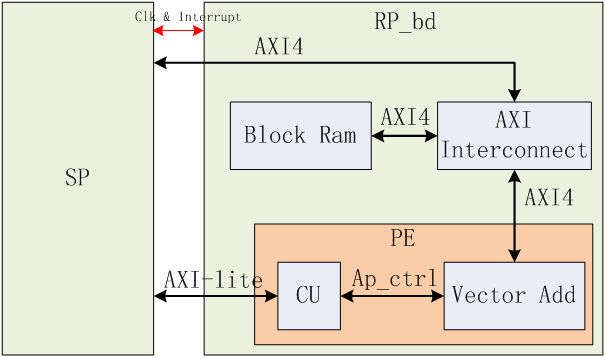
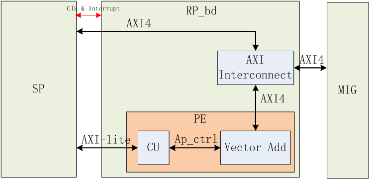

# 1.testreg demo工程
## 功能介绍
testreg工程是一个很简单的rp_bd模块，展示了如何使用rp_bd的AXI接口，如何使用DDR以及如何使用vivado的调试模块。
testreg有两个基本功能，一个是定义了4个寄存器可供host从axi-lite访问，寄存器定义如下表所示。

寄存器 | 位宽	 | 地址偏移 | R/W | 功能定义 
----|------|----|-----|-----
test_reg1 | 32bit | 0x0 | RW | 测试寄存器，可通过工具包中的reg_read_32和reg_write_32读写。
test_reg2 | 32bit | 0x4 | RW | 测试寄存器，可通过工具包中的reg_read_32和reg_write_32读写。
test_reg3 | 32bit | 0x8 | R | 测试寄存器，数值为test_reg1和test_reg2两者相加的结果，可通过工具包中的reg_read_32读取。
test_reg4 | 32bit | 0xC | R | 测试寄存器，数值为vio.probe_out0的输出，可通过工具包中的reg_read_32读取。

*实际使用reg_read_32和reg_write_32时，访问的地址要在上述地址偏移的基础上加上65536*

testreg的第二个功能是将xdma的axi-dma请求转化成访问app-mig的请求，实现这个功能需要正确的配置工程的DDR模式。
```bash
$ cd ~/hdk/baidu_fpga/baidu_hw_design_toolkit/prj_testreg/build/scripts/
$ cat step_00_setup.tcl
```
确认如下五行是否一致
 -- set USE_DDR4_C0 1
 -- set USE_DDR4_C1 0
 -- set USE_DDR4_C2 0
 -- set USE_DDR4_C3 0
 -- set USE_AXI_DDR 0
这样的话工具包在制作FPGA云镜像的时候，会自动为DDR C0通道生成一个app接口的mig控制器并与testreg的RP_bd模块相连。
*其实使用axi接口的mig控制器更为方便，这里testreg只是为了展示app接口mig的使用方式*

## 工程结构
testreg采用非IPI模式，usr_files/hdl中存储了工程的rtl文件，usr_files/ip中存储了工程用到的ip文件。执行build脚本时会自动生成配置DDR工作模式所需的define头文件和DDR xdc。

## 使用
testreg工程的仿真、制作和配置步骤，可以参考[说明-进行FPGA云镜像开发的流程](./说明-进行FPGA云镜像开发的流程.md)
配置完成后，可以执行reg_read_32和reg_write_32验证功能
```bash
$ cd ~/sdk/linux_kernel_driver/sample/
$ ./reg_read_32 0 65536
read success, addr = 0000000000010000, value = 00000000
$ ./reg_read_32 0 65540
read success, addr = 0000000000010004, value = 00000000
$ ./reg_read_32 0 65544
read success, addr = 0000000000010008, value = 00000000
$ ./reg_write_32 0 65536 100
write success, addr = 0000000000010000, value = 00000100
$ ./reg_read_32 0 65544
read success, addr = 0000000000010008, value = 00000100
$ ./reg_read_32 0 65548
read success, addr = 000000000001000c, value = 11111111   //输出结果与当前vio.probe_out0相关，可在vivado中修改
```

# 2.vectoradd_ram demo工程
## 功能介绍
vectoradd工程实现了一个向量浮点加的功能，其工作流程如下:
1. 软件发起dma_to_dev将输入向量A，B拷贝至dev；A，B的长度必须8个float数据对齐。（单精度浮点数）
2. 软件通过配置寄存器发起PE计算指令，然后等待计算完成
3. 计算完成后，逻辑通过中断通知CPU上的软件驱动程序。
4. 软件发起dma_from_dev将输出向量C拷贝至host。（单精度浮点数）

逻辑用到的寄存器地址空间如下表

寄存器 | 位宽 | 地址偏移 | R/W | 功能定义
----|-----|----|-----| ----
start |	32bit |		0x0 |		W |		start命令
A_addr |	32bit |		0x4 |		R/W |		A向量基地址，单位为字节，必须为32B的整数倍
B_addr |		32bit |		0x8 |		R/W |		B向量基地址，单位为字节，必须为32B的整数倍
C_addr	 |	32bit |		0xC |		R/W |		输出向量基地址，单位为字节，必须为32B的整数倍
array_len |		32bit |		0x10 |		R/W |		向量长度，即为实际float数据个数，必须为8的整数倍
test_reg |		32bit |		0x14，0x18，0x1C | R/W	 |	测试寄存器，可读写
version_reg	 |	32bit	 |	0x20	 |	R	 |	版本号寄存器

## 工程结构
vectoradd_ram工程的结构如下图所示

每个模块的具体如下

模块 | 说明
----|------
Block Ram | RP_bd内部有一个64KB的block ram用来存储计算所用的数据和计算结果，这个block ram可同时被host和卡上的用户逻辑访问，这是通过RP_bd中的一个AXI Interconnect实现的。
AXI Interconnect	| AXI Interconnect用于协调两个AXI master访问RP_bd中的Block Ram；SP内的xdma输出的AXI4连接到AXI Interconnect的一个slave端口，demo工程提供的drive支持host通过dma访问这个block ram；Vector Add模块输出的AXI4连接到AXI Interconnect的另一个端口，使得用户逻辑也可以访问这个block ram。 
CU	| 命令处理单元，SP输出的AXI-lite接口连接到该模块。CU模块解析从AXI lite收到的命令，并产生符合ap_ctrl总线的请求信号与Vector Add模块相连。ap_ctrl是通过HLS综合出的逻辑模块采用的一种标准状态控制总线。有关其详细介绍可以参考Xilinx ug902文档。
 Vector Add | 计算处理单元，Vector Add模块完成向量加法运算，它是使用HLS高级综合工具开发的，它的控制输入为一组HLS模块使用的ap_ctrl信号；他使用AXI总线协议将Block Ram中的数据读出，进行加法运算后，将数据写回Block Ram中。 

vectoradd_ram采用IPI模式，整个RP_bd就是一个block design。 usr_files/usr_ip_resposity存储了该block design所需的两个用户自定义IP（CU和Vector Add）的文件。
usr_files/usr_hls_prj是实现vector add模块的hls工程，该工程目录其实对于制作vectoradd_ram工程的镜像不是必须的，因为已经将该hls实现的vector add模块导出成ip放到了usr_files/usr_ip_resposity中，我们提供该hls工程是方便用户可以自己修改vector add的功能做些实验。

## 使用
vectoradd_ram工程的仿真、制作和配置步骤，可以参考[说明-进行FPGA云镜像开发的流程](./说明-进行FPGA云镜像开发的流程.md)

配置完成后，使用步骤可以参考 [stepbystep-制作并调试FPGAdemo逻辑](./stepbystep-制作并调试FPGAdemo逻辑.md)


# 3.vectoradd_ddr demo工程
该工程与vectoradd_ram十分相似，只是将存储三个向量的空间从片上block ram改成了卡上DDR。


