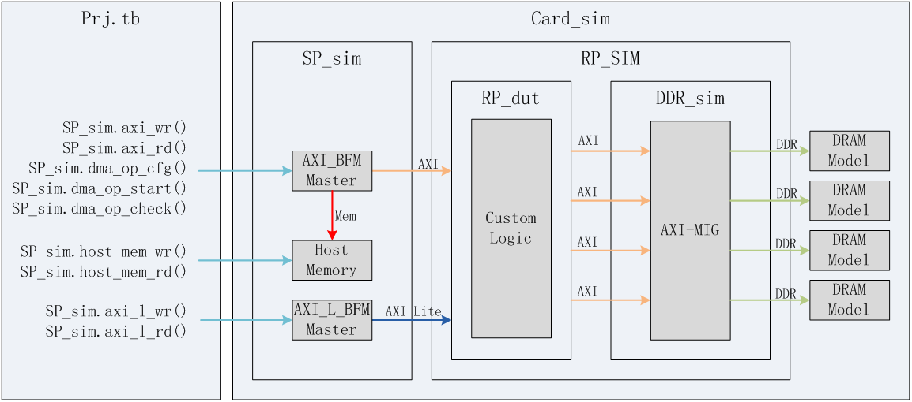
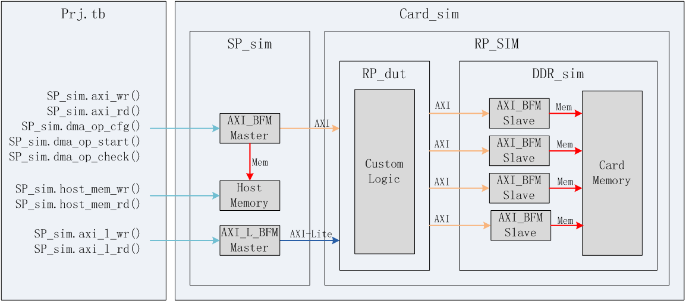
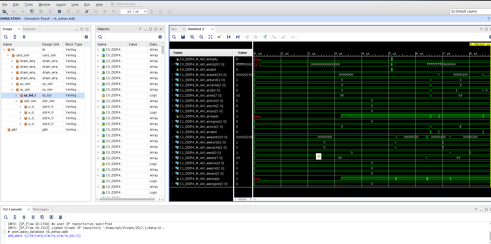

为了方便用户仿真，百度在FPGA标准开发镜像中提供了一个基于RTL的仿真环境。用户可以利用仿真环境提供的接口，编写适合自己逻辑的测试激励。
## 1.仿真环境的结构
仿真环境的主要结构如下图所示

  

其中`RP_dut`和`DDR_sim`就是工程动态部分的逻辑，`SP_sim`是工程静态部分逻辑的行为级仿真模型，dram model是xlinx MIG的example design提供的ddr颗粒仿真模型。

`SP_sim`包含了三部分，分别是`AXI_BFM_Master`，Host_Memory， `AXI_L_BFM_Master`。

`AXI_BFM_Master`负责接收testbench的激励，产生axi master接口信号与`RP_dut`的axi slave传输数据。具体的处理内容包括burst length，地址对齐，同id请求保序等处理。

- 调用`axi_wr`()/`axi_rd`()，`AXI_BFM_Master`可以产生burst length为1的axi读写请求。
- 调用`dma_op_cfg`()，`dma_op_start`()，`AXI_BFM_Master`可以产生dma请求，在Host Memory和Custom Logic之间传输大块数据。
- 根据`dma_op_cfg`()配置的长度，一个dma请求可能产生多个axi请求，每个axi请求支持可变的burst length但是不能跨越4KB边界。
- 支持4个dma通道，也就是并发4个dma请求。

`AXI_L_BFM_Master`负责接收testbench的激励，产生axi-lite master接口信号与`RP_dut`的axi-lite slave传输数据。具体的处理内容包括地址对齐，同id请求保序等处理。

- 调用`axi_l_wr`()/`axi_l_rd`()，`AXI_L_BFM_Master`可以产生axi lite读写请求。

Host Memory用于仿真host端的内存，支持byte对应的写mask。

- 调用`host_mem_wr`()和`host_mem_wr`() task访问。
- `AXI_BFM_Master`处理dma请求时的传输数据来自该模块。

## 2.仿真环境的接口
`SP_sim`提供了一些task，可供工程的具体测试激励调用。task定义如下：

#### axi_wr(addr,data,size)产生访问RP_BD_DUT.AXI的写请求  ####

| 参数名 | 方向 | 位宽 | 说明 |
| ------| ------ | ------ | ------ |
| addr	|input	|64|	写请求地址，以Byte为寻址单位|
| data	|input	|256|	写请求数据|
| size	|input	|4|	写请求大小，限定了写请求数据有多少是有效，需要写入的  4’d0, data[7:0]写入地址addr  4’d1, data[15:0]写入地址addr+1 ~ addr  4’d2, data[31:0]写入地址addr+3 ~ addr  4’d3, data[63:0]写入地址addr+7 ~ addr  4’d4, data[127:0]写入地址addr+15 ~ addr  4’d5, data[255:0]写入地址addr+31 ~ addr|

#### axi_rd(addr,data,size)产生访问RP_BD_DUT.AXI的读请求 ####

| 参数名 | 方向 | 位宽 | 说明 |
| ------| ------ | ------ | ------ |
| addr	|input	|64|	读请求地址，以Byte为寻址单位|
| data	|input	|256|	读请求数据|
| size	|input	|4|	读请求大小，限定了读请求数据返回数据有多少是有效的 4’d0, 读出地址addr的1byte，data[7:0]保存 4’d1,读出地址addr+1 ~ addr的2byte， data[15:0]保存 4’d2,读出地址addr+3 ~ addr的4byte， data[31:0]保存 4’d3,读出地址addr+7 ~ addr的8byte， data[63:0]保存 4’d4,读出地址addr+15 ~ addr的16byte， data[127:0]保存 4’d5,读出地址addr+31 ~ addr的32byte， data[255:0]保存|

#### dma_op_cfg(channel,src_addr,dst_addr,len,direction)配置一个dma请求 ####

| 参数名 | 方向 | 位宽 | 说明 |
| ------| ------ | ------ | ------ |
| channel	|input	|2|		dma请求使用的dma通道号|
| src_addr	|input	|64|	dma请求的数据源地址，以Byte为寻址单位|
| dst_addr	|input	|64|	dma请求的数据目的地址，以Byte为寻址单位|
| len	|input	|32|	dma请求的长度，以Byte为单位|
| direction	|input	|1|	dma请求的方向 1'd0，host memory --> rp_bd_dut 1'd1, rp_bd_dut --> host memory|

#### dma_op_start(channel)启动一个dma请求 ####
| 参数名 | 方向 | 位宽 | 说明 |
| ------| ------ | ------ | ------ |
| channel	|input	|2|		启动所在通道的dma请求|

#### dma_op_check(channel,status)查询一个dma请求的状态 ####
| 参数名 | 方向 | 位宽 | 说明 |
| ------| ------ | ------ | ------ |
| channel	|input	|2|		查询所在通道的dma请求|
| status	|output	|1|		返回dma通道的请求状态 1'd0 dma请求处理结束 1'd1 dma请求还在处理中|

#### host_mem_wr(addr,data,mask)以32Byte粒度写host memory ####
| 参数名 | 方向 | 位宽 | 说明 |
| ------| ------ | ------ | ------ |
| addr	|input	|64|		写请求地址，以Byte为寻址单位，地址要求32Byte对齐|
| data	|input	|256|		写请求数据|
| strb	|input	|32|		写请求strb|

#### host_mem_rd(addr,data)以32Byte粒度读host memory ####
| 参数名 | 方向 | 位宽 | 说明 |
| ------| ------ | ------ | ------ |
| addr	|input	|64|		读请求地址，以Byte为寻址单位，地址要求32Byte对齐|
| data	|output	|256|		读返回数据|

#### host_mem_wr_char(addr,data)以Byte粒度写host memory ####
| 参数名 | 方向 | 位宽 | 说明 |
| ------| ------ | ------ | ------ |
| addr	|input	|64|		写请求地址，以Byte为寻址单位|
| data	|output	|8|		写请求数据|

#### host_mem_rd_char(addr,data)以Byte粒度读host memory ####
| 参数名 | 方向 | 位宽 | 说明 |
| ------| ------ | ------ | ------ |
| addr	|input	|64|		读请求地址，以Byte为寻址单位|
| data	|output	|8|		读返回数据|

#### axi_l_wr(addr,data,size)产生访问RP_BD_DUT.AXI-Lite的写请求 ####
| 参数名 | 方向 | 位宽 | 说明 |
| ------| ------ | ------ | ------ |
| addr	|input	|16|		写请求地址，以Byte为寻址单位，地址要求32Byte对齐|
| data	|input	|32|		写请求数据|
| strb	|input	|4|		写请求strb|

#### axi_l_rd(addr,data)产生访问RP_BD_DUT.AXI-Lite的读请求 ####
| 参数名 | 方向 | 位宽 | 说明 |
| ------| ------ | ------ | ------ |
| addr	|input	|16|		读请求地址，以Byte为寻址单位，地址要求32Byte对齐|
| data	|output	|32|		读返回数据|

#### interrupt_wait(num)等待一个中断请求 ####
| 参数名 | 方向 | 位宽 | 说明 |
| ------| ------ | ------ | ------ |
| num	|input	|4|		等待中断的中断源 4‘d0, 等待RP_BD_DUT.usr_irq_req[0] …… 4‘d15, 等待RP_BD_DUT.usr_irq_req[15]|

## 3.demo工程的testbench范例
为了方便用户快速上手百度提供的仿真环境，可以参考如下所示的标准开发镜像中的prj_vectoradd_ram工程包含的测试激励。
通过仿真环境提供的task，方便的完成了一次向量加法的仿真操作，并读出计算结果检验正确性。

	initial begin
	  //inital vector a {1.0,2.0,3.0,4.0,5.0,6.0,7.0,8.0}
	  vector_a = {32'h3F800000, 32'h40000000, 32'h40400000, 32'h40800000, 32'h40A00000, 32'h40C00000, 32'h40E00000, 32'h41000000};
      //inital vector b {8.0,7.0,6.0,5.0,4.0,3.0,2.0,1.0}
      vector_b = {32'h41000000, 32'h40E00000, 32'h40C00000, 32'h40A00000, 32'h40800000, 32'h40400000, 32'h40000000, 32'h3F800000};
      //expect result for a+b
      expect_result = {(8){32'h41100000}};
      #5000;
	  //init host mem
	  host_a_addr = HOST_A_BASEADDR;
	  host_b_addr = HOST_B_BASEADDR;
	  host_result_addr = HOST_RESULT_BASEADDR;
	  repeat (VECTOR_LEN_WORDS) begin
		 card_sim.sp_sim.host_mem_wr(host_a_addr,vector_a,32'hffffffff);
		 card_sim.sp_sim.host_mem_wr(host_b_addr,vector_b,32'hffffffff);
		 card_sim.sp_sim.host_mem_wr(host_result_addr,256'd0,32'hffffffff);	
		 host_a_addr = host_a_addr + MASK_WIDTH;
		 host_b_addr = host_b_addr + MASK_WIDTH;
		 host_result_addr = host_result_addr + MASK_WIDTH;
	  end
	  //start dma operation for host2card
	  card_sim.sp_sim.dma_op_cfg('d0,HOST_A_BASEADDR,CARD_A_BASEADDR,VECTOR_LEN_BYTES,0);
	  card_sim.sp_sim.dma_op_cfg('d1,HOST_B_BASEADDR,CARD_B_BASEADDR,VECTOR_LEN_BYTES,0);
	  card_sim.sp_sim.dma_op_start('d0);
	  card_sim.sp_sim.dma_op_start('d1);
	  //wait for dma opertion end
	  wait (card_sim.sp_sim.dma_status == 4'b0);
	  //configure vector add parameter
	  card_sim.sp_sim.axi_l_wr(A_BASEADDR_REG,CARD_A_BASEADDR,4'hf);
	  card_sim.sp_sim.axi_l_wr(B_BASEADDR_REG,CARD_B_BASEADDR,4'hf);
	  card_sim.sp_sim.axi_l_wr(C_BASEADDR_REG,CARD_C_BASEADDR,4'hf);
	  card_sim.sp_sim.axi_l_wr(VECTOR_LEN_REG,VECTOR_LEN_NUMS,4'hf);
	  //start vector add operation
	  card_sim.sp_sim.axi_l_wr(START_CMD_REG,32'd0,4'hf);
	  //wait for vector add end
	  card_sim.sp_sim.interrupt_wait('d0);
	  //start dma operation for card2host
	  card_sim.sp_sim.dma_op_cfg('d0,CARD_C_BASEADDR,HOST_RESULT_BASEADDR,VECTOR_LEN_BYTES,1);
	  card_sim.sp_sim.dma_op_start('d0);
	  //wait for dma opertion end
	  wait (card_sim.sp_sim.dma_status == 4'b0);
	  //check result
	  host_result_addr = HOST_RESULT_BASEADDR;
	  repeat (VECTOR_LEN_WORDS) begin
		  card_sim.sp_sim.host_mem_rd(host_result_addr,calc_result);
	      if (calc_result != expect_result) begin
	    	  $display ("%g Test fail", $time);
			  $finish;
          end
	      host_result_addr = host_result_addr + MASK_WIDTH;
      end
      $display ("%g Test pass", $time);
	  $finish;
    end

## 4.仿真环境的快速模式
考虑到仿真时处理DDR_sim的仿存请求时，需要仿真MIG的内部功能和dram颗粒。而很多时候为了加速仿真工作，我们并不需要仿真这些细节，百度还为仿真环境提供了一个快速模式。其结构如下图所示

 
  

通过`AXI_BFM_Slave`和Card Memory两个模块处理卡上内存访问请求，节省了参与仿真的逻辑代码，可以加快整体仿真速度，提高效率。

虽然快速模式丢失了内存读写带宽的真实行为表现，但在多数开发场景下，是足以满足仿真需求的。

## 5.仿真环境的目录结构
仿真环境涉及到两部分，一部分是不同工程下通用的一些文件，放在了`baidu_hw_design_toolkit/common_files/sim`下面，主要包含了

- 顶层文件，如card_sim，sp_sim，rp_sim,ddr_sim
- 静态仿真模型文件，如axi_master_bfm，axi_l_master_bfm
- 所需的其他一些ip的仿真文件，如ddr，fifo，dram等
- 仿真所需的通用脚本，主要是用于产生IPI工程下的仿真文件，或者非IPI工程用到的ip的仿真文件。

另一部分则是根据具体工程的仿真需求所用到的特定的文件，放在了`baidu_hw_design_toolkit/prj_name/usr_files/sim`下面，需要根据工程由用户自己编写，用户可以参考demo工程中包含的几个主要文件

- 测试激励文件，建议放在tb目录下，调用sp_sim提供的task，将测试激励数据发给rp。
- 仿真用到的脚本，几个文件的用途如下
	- sim_vivado.sh，启动仿真的脚本，里面定义了进行vivado仿真时使用的命令，需要根据实际情况修改参数，如执行xelab时用到的额库
	- tb_wave.tcl，定义仿真时要观测的信号，可根据需要自行添加。
	- top.vivado.v.f，sim_vivado脚本执行xvlog时用到的参数，定义了仿真中用到的verilog文件
	- top.vivado.vhd.f，sim_vivado脚本执行xvhdl时用到的参数，定义了仿真中用到的VHDL文件
	- open_waves.tcl，用于打开仿真结果，查看tb_wave.tcl中定义的观察信号。使用方法，执行完sim_vivado.sh之后会产生一个`usr_files/sim/sim_vivado`目录，进入该目录后执行`vivado -source ../scripts/open_waves.tcl`,vivado就会启动并载入仿真时观察的信号。界面如下图所示。	
  

