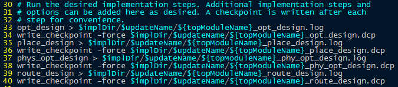
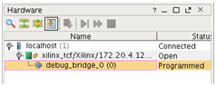
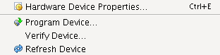
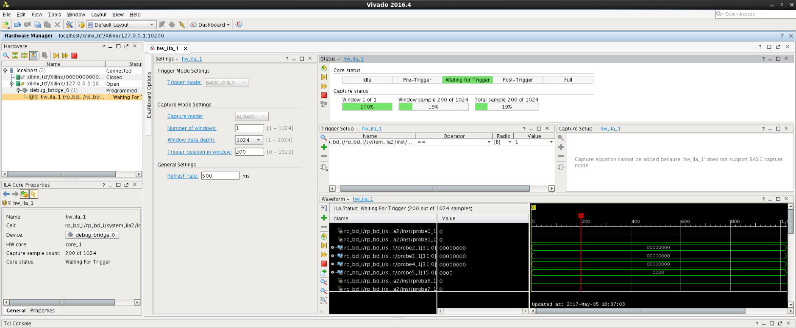

本文档基于开发包中的demo工程，介绍进行FPGA云镜像开发的各个流程步骤。
有关demo工程的功能说明可以参考[说明-demo工程介绍](./说明-demo工程介绍.md) 

# 1.Baidu_HW_design_toolkit目录结构
`Baidu_HW_design_toolkit`提供了制作fpga硬件逻辑所需的环境，您只要将自己逻辑所需的相关的文件如rtl代码，ip核，xdc约束等放入指定的路径，然后执行脚本，即可生成用于烧写fpga云服务器的逻辑镜像文件。

`Baidu_HW_design_toolkit`包含了4个子文件夹，分别是common_files和三个demoprj工程。

- common_files存放fpga云服务器工程的一些通用设计。
- `static_fix_dcp`中保存的是工程的静态部分dcp，包括pcie控制器和支持xvc所需的ip core。
- hdl存放了一个`rp_wrapper.v`的rtl文件，这可以算是fpga云服务器工程中静态部分逻辑与动态部分逻辑的一个接口。您要实现的定制逻辑就是`rp_wrapper`中实例化的rp_bd模块。
- Constraints存放了对`rp_wrapper`模块进行ooc综合所需的约束文件。
- ref_xdc存放了FPGA云服务器的内存控制器引脚约束。
- sim存放了静态部分逻辑的仿真模型。

*通常情况下，我们不建议您修改common_files目录中的内容。*

每个demo工程文件下下面包含build和`usr_files`两个子文件夹。`usr_files`存放用户的工程设计文件，它包含了5个子文件夹:

- usr_rtl用于存放用户逻辑使用的rtl文件。
- usr_xdc用于存放用户逻辑所需的约束文件。
- usr_ip用于存放用户逻辑所使用的ip xci文件。
- usr_ip_resposity用于存放用户自己封装的ip库。
- sim存放了该工程仿真所需的脚本和testbench，一般来说，在单个工程仿真时都需要调用common_files下的静态逻辑仿真模型文件。

build存放制作FPGA云服务器逻辑镜像所要执行的脚本，如果您是有经验的用户，可以参考并根据自己的需要修改脚本。

# 2.仿真FPGA云服务逻辑工程

有关仿真环境的详细设计介绍可以参考[说明-仿真环境介绍](./说明-仿真环境介绍.md) 

## 仿真testreg工程
首先确认testreg工程的当前ddr设置
```bash
$ cd ~/hdk/baidu_hw_design_toolkit/prj_testreg/build/scripts/
$ cat step_00_setup.tcl
```
确认如下五行是否一致
 -- set USE_DDR4_C0 0
 -- set USE_DDR4_C1 0
 -- set USE_DDR4_C2 0
 -- set USE_DDR4_C3 0
 -- set USE_AXI_DDR 0

执行仿真脚本
```bash
$ cd ~/hdk/baidu_hw_design_toolkit/prj_testreg/usr_files/sim/script
//寄存器仿真，只检查工程中的功能寄存器
$ sh sim_vivado.sh  
//增加对于ddr的仿真，采用快速ddr仿真模式
$ sh sim_vivado.sh -d FAST_SIM -d USE_APP_DDR -d USE_DDR4_C0 -d USE_DDR 
//增加对于ddr的仿真，采用标准ddr仿真模式
$ sh sim_vivado.sh -d USE_APP_DDR -d USE_DDR4_C0 -d USE_DDR 
```
## 仿真vectoradd_ddr工程
首先确认testreg工程的当前ddr设置
```bash
$ cd ~/hdk/baidu_hw_design_toolkit/prj_vectoradd_ddr/build/scripts/
$ cat step_00_setup.tcl
```
确认如下五行是否一致
 -- set USE_DDR4_C0 1
 -- set USE_DDR4_C1 1
 -- set USE_DDR4_C2 1
 -- set USE_DDR4_C3 1
 -- set USE_AXI_DDR 1
执行仿真脚本
```bash
$ cd ~/hdk/baidu_hw_design_toolkit/prj_vectoradd_ddr/usr_files/sim/script
//IPI工程仿真，采用快速ddr仿真模式
$ sh sim_vivado.sh -ipi -d FAST_SIM 
//IPI工程仿真，采用标准ddr仿真模式
$ sh sim_vivado.sh -ipi
```
## 仿真vectoradd_ram工程
首先确认testreg工程的当前ddr设置
```bash
$ cd ~/hdk/baidu_hw_design_toolkit/vectoradd_ram/build/scripts/
$ cat step_00_setup.tcl
```
确认如下五行是否一致
 -- set USE_DDR4_C0 0
 -- set USE_DDR4_C1 0
 -- set USE_DDR4_C2 0
 -- set USE_DDR4_C3 0
 -- set USE_AXI_DDR 0
执行仿真脚本
```bash
$ cd ~/hdk/baidu_hw_design_toolkit/vectoradd_ram/usr_files/sim/script
//IPI工程仿真
$ sh sim_vivado.sh -ipi
```
每次执行仿真脚本，如果有输出"Test pass”,则表明仿真正确。

# 3.制作FPGA云服务逻辑镜像步骤
`Baidu_HW_design_toolkit`提供了两种方式制作FPGA云服务器逻辑镜像。两种方式需要准备不同的设计文件，您可以任选一种自己喜欢的方式。

## 1) Non_IPI流程

这种方式比较类似传统的FPGA工程实现方式，您需要准备好动态部分逻辑（也就是`rp_wrapper.rp_bd_i`）的设计文件放入usr_files指定的目录， 然后执行build目录下的run\_nonIPI.tcl脚本。

以prj_testreg工程作为制作逻辑镜像的示范例子，具体步骤如下所示。

*由于默认的`Baidu_HW_design_toolkit/prj_testreg/usr_files`目录里已经包含了demo工程的设计文件，您也可以跳过1~4，直接从步骤5开始，执行脚本体验制作云服务器逻辑镜像的过程。*

- 用户定制rp_bd所用到的约束文件，需全部拷贝到工具包中`Baidu\_HW_design_toolkit/prj_testreg/usr_files/usr_xdc`目录下。
- 用户定制rp_bd所用到的rtl文件，需全部拷贝到工具包中`Baidu\_HW_design_toolkit/prj_testreg/usr_files/usr_rtl`目录下。
- 用户定制rp_bd所用到的ip core文件，需全部拷贝到工具包中`Baidu_HW_design_toolkit/prj_testreg/usr_files/usr_ip`目录下。
- 用户定制rp_bd所用到的自己封装的ip库，需全部拷贝到工具包中`Baidu_HW_design_toolkit/prj_testreg/usr_files/usr_ip_resposity`目录下。
- 打开`Baidu_HW_design_toolkit/prj_testreg/build/scripts/step_00_setup.tcl`，确认如下五行是否一致
 -- set USE_DDR4_C0 0
 -- set USE_DDR4_C1 0
 -- set USE_DDR4_C2 0
 -- set USE_DDR4_C3 0
 -- set USE_AXI_DDR 0
- 进入`Baidu_HW_design_toolkit/prj_testreg/build`目录，执行vivado -mode batch -source ./run_nonIPI.tcl
- 制作FPGA云服务逻辑镜像完成，你可以从`Baidu_HW_design_toolkit/prj_testreg/build/proDir/Bitstreams/ver2`文件夹下面看到生成的镜像文件。

## 2) IPI流程
这种方式采用vivado IP Integrator制作云服务逻辑镜像的动态部分逻辑（也就是`rp_wrapper.rp_bd_i`）。你需要准备好IPI的设计文件放入usr_files和build下指定的目录，然后执行build目录下的run\_IPI.tcl脚本。

以`prj_vectoradd_ddr`工程作为制作逻辑镜像的示范例子，具体步骤如下所示。

*由于默认的`Baidu_HW_design_toolkit/prj_vectoradd_ddr/usr_files`目录里已经包含了demo工程的IPI设计文件，您也可以跳过1~4，直接从步骤5开始，执行脚本体验制作云服务器逻辑镜像的过程。*

- 用户定制rp_bd block design所用到的约束文件，需全部拷贝到工具包中`Baidu_HW_design_toolkit/prj_vectoradd_ddr/usr_files/usr_xdc`目录下。
- 用户定制rp_bd block design所用到的rtl文件，需全部拷贝到工具包中`Baidu_HW_design_toolkit/prj_vectoradd_ddr/usr_files/usr_rtl`目录下。
- 用户定制rp_bd block design所用到的自己封装的ip库，需全部拷贝到工具包中`Baidu_HW_design_toolkit/prj_vectoradd_ddr/usr_files/usr_ip_resposity`目录下。
- 用户定制rp_bd block design所用到的tcl文件，需命名为`rp_bd.tcl`并拷贝到工具包中`Baidu_HW_design_toolkit/prj_vectoradd_ddr/build/scripts`目录下。
- 打开`Baidu_HW_design_toolkit/prj_vectoradd_ddr/build/scripts/step_00_setup.tcl`，确认如下五行是否一致
 -- set USE_DDR4_C0 1
 -- set USE_DDR4_C1 1
 -- set USE_DDR4_C2 1
 -- set USE_DDR4_C3 1
 -- set USE_AXI_DDR 1
- 进入`Baidu_HW_design_toolkit/prj_vectoradd_ddr/build`目录，执行vivado -mode batch -source ./run_IPI.tcl
- 制作FPGA云服务逻辑镜像完成，你可以从`Baidu_HW_design_toolkit/prj_vectoradd_ddr/build/proDir/Bitstreams/ver2`文件夹下面看到生成的镜像文件。

# 4.检查制作好的FPGA云服务逻辑镜像
1) 请您确认 build/projDir/Bitstreams/my_top_pr_verify.log 文件中显示：

```
INFO: [Vivado 12-3253] PR_VERIFY: check points ../common_files/static_fix_dcp/my_top_route_design.dcp and ./projDir/Implement/ver2/my_top_route_design.dcp are compatible
```

2) 请您查看build/projDir/Implement/ver2/report_timing_summary.rpt  中的时序报告

3) 您可以修改build/scripts/step_03_impl_ver2.tcl 中的33-39行，用更加激进的策略管理您的工程实现

 

输出目录

目录 | 文件 | 说明
----|------|----
build/projDir/Synth/ver2/ | 	ver2_synth.dcp  ver2_synth.log  | 您的动态部分逻辑的综合报告
build/projDir/Implement/ver2/  | *.dcp *.log | 整体工程的实现各个阶段的报告
build/projDir/Bitstreams/ver2/ | *.bit *.ltx *.bin  | 	含有您开发的动态逻辑对应的bit文件；其中_clear.bin结尾的文件用于：在FPGA中已经烧写了您本次开发的动态逻辑时，需要为FPGA烧写新的动态逻辑时使用；其中_partial.bin结尾的文件用于为FPGA烧写您本次开发的动态逻辑时使用；其中_partial.ltx结尾的文件用于调试您动态逻辑中的ILA和VIO时使用 

# 5.使用bin_pr_tools更换您的动态逻辑

## 准备事项

在sdk/mgmt_tool目录下，含有更换您的FPGA动态部分逻辑的必要工具。


请注意：

1）更换动态逻辑前，您必须已经生成了自己的动态逻辑对应的partial.bin文件。

您可以在如下路径找到您需要的bin文件：

路径是您开发动态逻辑时使用的Baidu_HW_design_toolkit/prj_vectoradd_ddr/build/projDir/Bitstreams/ver2/

2）您需要准备好对应的partial_clear.bin文件。路径与上述一致。


## 更换逻辑

下面使用sdk/mgmt_tool目录下的bce_fpga_mgmt_tool更换逻辑

$ ./bce_fpga_mgmt_tool LoadPartialLogic -S 0 -P [您的动态逻辑partial.bin文件路径]

您还可以使用bce_fpga_mgmt_tool恢复成FPGA的初始动态逻辑

$ ./bce_fpga_mgmt_tool LoadDefaultPartialLogic -S 0

## 目录说明

目录 | 文件 | 说明 
----|------|----
bin | 含有对FPGA进行配置的bin | 不允许用户修改
mcap | 含有对FPGA进行配置的工具  | 不允许用户修改
base | 含有初始状态下的base module | 不允许用户修改


# 6.使用Vivado对您的动态逻辑进行调试

帮助您像平时使用vivado一样，对您的动态逻辑进行调试。  
在使用该工具包前，您需要确保FPGA的驱动程序已经加载。
请您先准备好您的动态逻辑对应的debug_probe文件。  

1）进入xvc_server工具包，该工具包用于支持vivado工具使用虚拟jtag；运行工具包内的工具如下：  
$sudo ./xvc_pcie  
程序会在前台保持运行，您当前看不到任何输出，是正常的。
  
2）请切换至root账号，然后使用root账号打开vivado工具  
打开vivado工具后，点击Open Hardware Manager

 

3）在console中输入：  
$connect_hw_server  
$open_hw_target -xvc_url 127.0.0.1:10200

4）您可以看到在Hardware窗口下可以看到设备，名为debug_bridge

 

点击debug_bridge后，可以在属性窗口，找到probes file一行：

 

点击右侧的浏览按钮，选择您需要的probe file。点击OK

您可以在如下路径找到您需要的probe file文件：

路径是您开发动态逻辑时使用的~/baidu_HW_design_toolkit/prj_***/build/projDir/Bitstreams/ver2/ver2_rp_bd_i_partial.ltx

 

在设备上右键选择refresh device

 

至此您可以像平时使用Vivado工具一样用您工程中的ila和vio进行功能调试和信号查看。

 