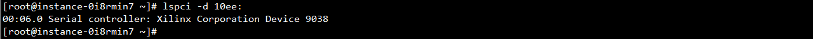
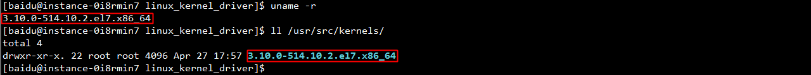
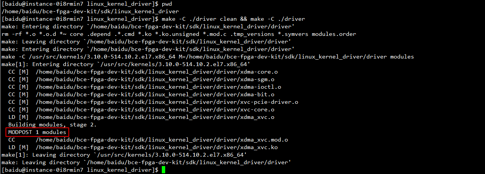
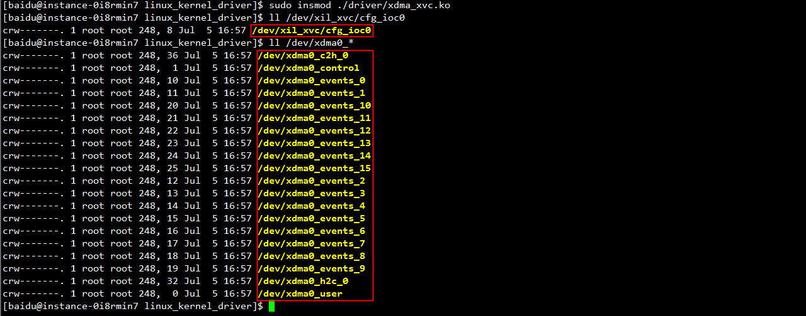
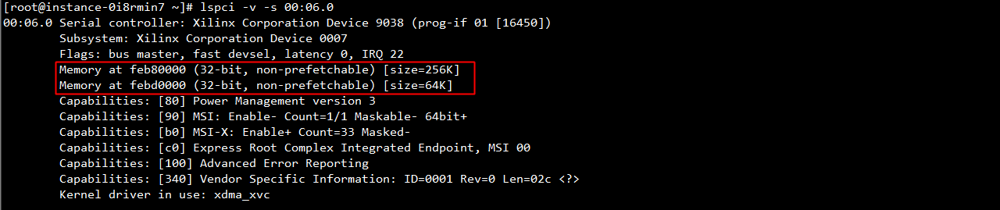
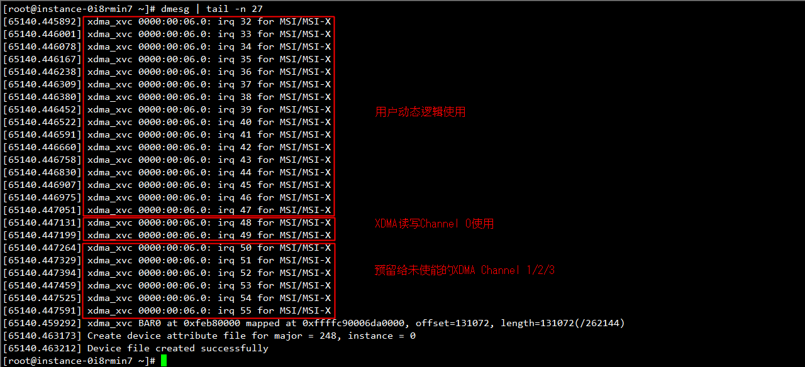

# 如何在百度云FPGA开发环境中使用内核驱动

## 目录
1. [概览](#overview)
1. [编译加载](#compile_and_install)
1. [BAR空间](#bar_layout)
1. [中断处理](#interrupt)
1. [XVC支持](#xvc_support)
1. [XDMA支持](#xdma)
1. [可扩展框架](#extensible_framework)

<a name="overview"></a>
## 概览

该内核驱动适用于百度云FPGA开发环境，即透传了FPGA的百度云虚拟机实例，提供以下功能：

- 根据PCIe Vendor/Device ID探测和识别透传后的FPGA硬件设备
- 映射FPGA的PCIe BAR空间，向外提供寄存器读写接口，使能前对FPGA进行适当配置
- 智能识别和管理Legacy Interrupt、MSI、MSI-X三种类型的中断
- 支持高性能低CPU开销的Xilinx官方版本XDMA，用户态程序能方便地通过读写设备文件来访问板载DDR
- 预留了可扩展框架，用户宜基于此自定义ioctl接口、开发高级功能
- 支持Xilinx Virtual Cable

该驱动在虚拟机自带3.10.0-514.16.1.el7.x86_64版本linux内核上通过了长时间稳定性测试，如非必要请勿升级或更换其他版本内核。

<a name="compile_and_install"></a>
## 编译加载

通过vnc或ssh登录虚拟机，进入该驱动所在目录，一般为`$HOME/bce-fpga-dev-kit/sdk/linux_kernel_driver/`。执行`git pull`，同步驱动至最新版本。

执行`sudo lspci -d 10ee:`，输出非空证明FPGA设备已被正确透传给虚拟机。



确保虚拟机内已正确安装了编译工具链和内核模块编译支持。如否，请执行`sudo yum -y install gcc gcc-c++ binutils kernel-devel`。最后，请确认`/usr/src/kernels/`目录下存在与当前内核版本`uname -r`同名的文件夹，如下图所示。



在当前目录执行`make -C ./driver clean && make -C ./driver`，生成编译产出内核模块`./driver/xdma_xvc.ko`，打印下图红框所示部分说明编译成功。



执行`sudo insmod ./driver/xdma_xvc.ko`加载上一步生成的内核模块，`/dev`目录下出现下图红框所示设备文件说明驱动加载成功。



默认该驱动创建的设备文件权限为600，即仅允许root用户访问，可能导致后续操作提示权限不足。如需让普通用户获得访问权限，请在当前目录执行`sudo cp ./etc/udev/rules.d/* /etc/udev/rules.d/`将udev规则拷贝至系统目录，并执行`sudo rmmod xdma_xvc && sudo insmod ./driver/xdma_xvc.ko`重新加载驱动。或者，直接执行`sudo chmod 666 /dev/xil_xvc/cfg_ioc0 /dev/xdma0_*`，以上修改权限操作仅单次生效。

<a name="bar_layout"></a>
## BAR空间

使用lspci查看透传后的FPGA设备如图所示，FPGA作为一个PCIe设备提供了两个BAR空间，即BAR 0和Bar 2，大小分别为256K和64K。该驱动加载后会调用pci_iomap()函数来映射这些BAR空间。



当前版本的BAR空间详细布局如下表所示，后续版本中可能会对其进行调整，请以github上的最新文档为准。

| BAR Index  | BAR Offset                          | Usage                |
|:----------:|:------------------------------------|:---------------------|
| BAR 0      | 0x00000000\~0x00010000 [0\~64K)     | 静态逻辑占用<br/><br/>0x0008-隔离寄存器<br/>0x00f8-软复位寄存器<br/>0x0100-温度寄存器<br/>0x0200~0x0400-Flash/Config寄存器<br/>0xfc00-清用户中断寄存器<br/> |
| BAR 0      | 0x00010000\~0x00020000 [64K\~128K)  | 用户动态逻辑占用     |
| BAR 0      | 0x00020000\~0x00030000 [128K\~192K) | XVC Debug Bridge占用 |
| BAR 0      | 0x00030000\~0x00040000 [192K\~256K) | RESERVED             |
|            |                                     |                      |
| BAR 2      | 0x00000000\~0x00010000 [0\~64K)     | XDMA配置占用         |

<a name="interrupt"></a>
## 中断处理

该驱动理论上能够支持Legacy Interrupt、MSI、MSI-X三种类型的中断。目前，出于性能和便捷度等因素考虑，百度云FPGA开发环境仅使用了[MSI-X](https://en.wikipedia.org/wiki/Message_Signaled_Interrupts#MSI-X)中断。驱动加载后会使能设备的MSI-X中断并为其分配中断向量，此时可以通过dmesg看到如下信息，每个中断向量的作用已在图上标示。如需获取更详细的中断信息，譬如中断计数和亲核性，请查看`/proc/interrupts`和`/proc/irq/<irq number>/`下的相关内容。



开发者可以在Vivado工程中自定义FPGA的动态逻辑，并使用上图标示的16个用户中断来实现事件完成通知。**驱动在收到用户中断后，ISR即中断处理函数的默认处理例程是唤醒一个在该中断对应之wait_queue_t上等待的线程，此后该线程会从阻塞的`read()`或`poll()`系统调用中返回用户态。**

```c
fd = open(“/dev/xdma0_events_0”, O_RDONLY);
if (fd == -1) {
	perror("open failed");
}

/* polling on event0/interrupt0 */
struct pollfd fds[] = {
	{ fd, POLLIN },
};

int rc = poll(&fds, 1, 0);
if (r < 0) {
	/* ... there was an error! ... */
} else {
	if(fds[0].revents & POLLIN) {
		/* ... event0 (fd) was triggered!! ... */
	}
}

close(fd);
```

一些简单的非竞态事件等待可以参照以上示例代码通过poll某个event设备文件来完成。若需自定义ISR来实现高级功能，如支持多线程事件等待唤醒机制，请参考后文[可扩展框架](#extensible_framework)部分。

<a name="xvc_support"></a>
## XVC支持

XVC是[Xilinx Virtual Cable](https://www.xilinx.com/products/intellectual-property/xvc.html)的缩写，能够以PCIe为信道提供虚拟JTAG调试支持，便于开发者远程调试。XVC支持两种工作模式，一种是读写PCIe Configuration Space，另一种是读写PCI BAR。两者的选择可以参考setup_xvc_algo()函数，它由FPGA硬件逻辑配置和用户显式选择决定，该驱动默认采用后者。

该驱动加载后，可以在`/dev`目录下看到驱动暴露的字符设备文件`/dev/xil_xvc/cfg_ioc0`，xvc_pcie这个用户态JTAG server通过ioctl访问这个设备文件来服务Vivado中的debugger。

<a name="xdma"></a>
## XDMA支持

[XDMA](https://www.xilinx.com/products/intellectual-property/pcie-dma.html)是Xilinx在PCIe上提供的DMA解决方案，具有高性能、低开销、可配置性强等优点。该驱动即为从Xilinx的官方演示版本移植优化而来。

### 特性与限制

- HOST端和FPGA端均支持任意合法DMA地址和长度，即对DMA地址和长度无对齐要求
- 支持Zero-Copy，数据直接在用户态缓冲区和FPGA间传递，无需额外拷贝，提升性能
- 支持多线程并发，用户态线程可以同时发起DMA，驱动中Critical Section即临界区极短
- 读写双向均支持最多4个Engine/Channel，独立中断独立调度

<br/>

- 暂不支持以POSIX AIO方式发起异步DMA

### 使用POSIX标准文件操作进行DMA

开发者可以使用POSIX标准文件操作发起DMA，如`open()/pread()/pwrite()/close()`，详见下文。**虽然DMA支持多线程并发，为了语义正确，开发者应确保多个线程操作的应用程序缓冲区和FPGA板载DDR区域不存在读写冲突。同时，开发者在调用`close()`关闭已打开的设备文件描述符时应保证之前在该描述符上发起的所有读写操作均已返回，否则可能会导致未定义行为。**

#### HOST-to-FPGA DMA

```c
int fd = open("/dev/xdma0_h2c_0", O_WRONLY);
if (fd == -1) {
	perror("open failed");
}

ssize_t nbytes = pwrite(fd, USERSPACE_BUFFER_ADDR, DMA_SIZE, FPGA_DDR_ADDR);
if (nbytes != DMA_SIZE) {
	perror("pwrite failed");
}

close(fd);
```

以上示例代码将`USERSPACE_BUFFER_ADDR`指向的大小为`DMA_SIZE`字节的应用程序缓冲区中的数据拷贝至FPGA板载DDR偏移为`FPGA_DDR_ADDR`处。`pwrite()`为同步阻塞操作，函数正确返回即表示数据已被写入FPGA板载DDR。**函数返回值`nbytes`可能会小于`DMA_SIZE`，开发者此时应对未完成部分再次发起`pwrite()`调用。**

#### FPGA-to-HOST DMA

```c
int fd = open("/dev/xdma0_c2h_0", O_RDONLY);
if (fd == -1) {
	perror("open failed");
}

ssize_t nbytes = pread(fd, USERSPACE_BUFFER_ADDR, DMA_SIZE, FPGA_DDR_ADDR);
if (nbytes != DMA_SIZE) {
	perror("pwrite failed");
}

close(fd);
```

以上示例代码将FPGA板载DDR偏移为`FPGA_DDR_ADDR`处大小为`DMA_SIZE`字节的数据拷贝至`USERSPACE_BUFFER_ADDR`指向的应用程序缓冲区。`pread()`为同步阻塞操作，函数正确返回即表示数据已获取至应用程序缓冲区。**函数返回值`nbytes`可能会小于`DMA_SIZE`，开发者此时应对未完成部分再次发起`pread()`调用。**

### 封装API

百度云FPGA开发环境sdk为DMA封装了更为明确易用的接口，详见[llapi](../llapi)。

### 性能数据

下表数据在百度FPGA云开发环境真实虚拟机实例内测得。由于虚拟化环境中存在DMA重映射和中断注入环节，故其性能要弱于同等配置物理机上的情形。

#### HOST-to-FPGA DMA带宽

|DMA_SIZE    |64B|256B|1KB|4KB|16KB|64KB|256KB|1MB|4MB|16MB|64MB|
|:----------:|--:|---:|--:|--:|---:|---:|----:|--:|--:|---:|---:|
|1 thread    |1.13MB/s|7.64MB/s|18.45MB/s|74.57MB/s|248.16MB/s|856.69MB/s|2090.69MB/s|3436.79MB/s|3856.09MB/s|3986.15MB/s|3682.61MB/s|
|2 threads   |1.18MB/s|4.77MB/s|19.15MB/s|65.63MB/s|247.14MB/s|699.89MB/s|1463.78MB/s|2248.06MB/s|2294.19MB/s|2380.15MB/s|2123.39MB/s|
|4 threads   |0.65MB/s|2.78MB/s|9.18MB/s|34.19MB/s|116.73MB/s|402.47MB/s|866.40MB/s|1144.47MB/s|1131.25MB/s|1185.64MB/s|1059.18MB/s|

#### FPGA-to-HOST DMA带宽

|DMA_SIZE    |64B|256B|1KB|4KB|16KB|64KB|256KB|1MB|4MB|16MB|64MB|
|:----------:|--:|---:|--:|--:|---:|---:|----:|--:|--:|---:|---:|
|1 thread    |1.27MB/s|5.60MB/s|21.95MB/s|78.08MB/s|287.23MB/s|786.80MB/s|1877.78MB/s|3585.73MB/s|3780.36MB/s|3661.72MB/s|3726.27MB/s|
|2 threads   |1.24MB/s|4.95MB/s|22.80MB/s|75.42MB/s|257.62MB/s|739.32MB/s|1339.65MB/s|1995.43MB/s|2286.10MB/s|2262.02MB/s|2161.21MB/s|
|4 threads   |0.76MB/s|2.58MB/s|10.97MB/s|51.31MB/s|124.57MB/s|364.20MB/s|788.21MB/s|1022.64MB/s|1074.60MB/s|1080.96MB/s|1096.85MB/s|

<a name="extensible_framework"></a>
## 可扩展框架

一些特殊操作仅可在内核态进行，例如分配多页物理连续内存，又如在收到用户中断后唤醒指定线程，开发者不可避免要去修改驱动代码。为了降低开发难度、提升开发效率，该驱动自带了可扩展框架。该框架代码与驱动其他模块松耦合，支持用户态程序对`/dev/xdma0_user`设备文件发起的IOCTL调用，开发者宜基于此快速搭建自定义业务接口，详情请见[extensible_framework.c](../linux_kernel_driver/driver/extensible_framework.c)。

### 自定义init和exit函数

开发者宜自定义`ext_init()`和`ext_exit()`函数来管理框架其余部分可能用到的资源，其分别在`probe()`函数尾部和`remove()`函数头部被调用。**如开发环境实例中存在多块FPGA设备，则以上函数会被调用多次，分别对应了每一块FPGA设备的初始化和释放，此时开发者可以依据传入参数`lro`中的成员`instance`来作区分。**

```c
/**************************************************************************************/
/*                               Define init/exit function here                       */
/**************************************************************************************/
void ext_init(struct xdma_dev *lro)                                                     
{                                                                                       
    dbg_ext("lro=%p, lro->instance=%d\n", lro, lro->instance);                          
    /* alloc resources that may be used in IRQ handler or user-defined IOCTL */         
    return;                                                                             
}                                                                                       
                                                                                        
void ext_exit(struct xdma_dev *lro)                                                     
{                                                                                       
    dbg_ext("lro=%p, lro->instance=%d\n", lro, lro->instance);                          
    /* free resources alloc-ed in `ext_init()` */                                       
    return;                                                                             
}                                                                                       
```

### 自定义用户中断处理

开发者能为16个用户中断自定义处理逻辑。首先，请定义原型为`void user_irq_handler(struct xdma_irq *)`的中断处理函数，再将函数指针数组`ext_user_irq_handler_tbl`的对应项赋值，该中断处理函数即会在用户中断到来后被自动调用。若开发者未定义处理函数或未对数组项赋值，则驱动的默认处理例程是唤醒在`user_irq->events_wq`上等待的线程。**请注意，应避免在中断处理函数中睡眠或做耗时较长的复杂操作。**

```c
/**************************************************************************************/
/*                               Define User IRQ handler here                         */
/**************************************************************************************/
static void user_irq_0_handler(struct xdma_irq *user_irq)
{
    struct xdma_dev *lro = user_irq->lro;
    dbg_ext("lro=%p, lro->instance=%d\n", lro, lro->instance);
    return;
}

static void dummy_irq_handler(struct xdma_irq *user_irq)
{
    return;
}

const user_irq_handler ext_user_irq_handler_tbl[MAX_USER_IRQ] = {
    [0] = &user_irq_0_handler,
	[1..15] = &dummy_irq_handler,
};
```

### 自定义IOCTL接口

开发者可在该框架中自定义业务相关的IOCTL接口，为用户态应用程序提供语义清晰、易于使用的高层API。首先，请用`_IO/_IOW/_IOR/_IOWR`宏定义一个不重复的IOCTL命令字`cmd`，再定义该接口的具体实现函数`do_xxx()`（典型流程为准备数据->写寄存器发起命令->等待命令完成->写回数据->释放资源），最后在`ext_user_ioctl()`函数的switch语句内依据`cmd`做调用分派。用户态应用程序对`/dev/xdma0_user`设备文件发起IOCTL调用后，执行流最终会进入该具体实现函数`do_xxx()`。

```c
/**************************************************************************************/
/*                               Define IOCTL cmd here                                */
/*                                    Pls. refer to                                   */
/* https://github.com/torvalds/linux/blob/master/Documentation/ioctl/ioctl-number.txt */
/**************************************************************************************/
#define IOCTL_AXI_SLAVE_DMA                 _IOWR(XDMA_IOC_MAGIC, 1, int)

/**************************************************************************************/
/*                               Define IOCTL impl. here                              */
/**************************************************************************************/
static long do_axi_slave_dma(struct xdma_dev *lro)
{
    int rc = 0;
    unsigned long vaddr = 0;
    dma_addr_t paddr = 0;
    /* XXX: refer to https://github.com/Cwndmiao/bce-fpga-dev-kit/tree/master/sdk/doc#bar_layout */
    void *reg = lro->bar[lro->user_bar_idx] + (64 << 10);
    struct xdma_irq *user_irq = &lro->user_irq[0];
    unsigned long flags;
    static DEFINE_MUTEX(axi_slave_dma_mutex);

    mutex_lock(&axi_slave_dma_mutex);
    vaddr = __get_free_pages(GFP_KERNEL, 1);
    if (!vaddr) {
        goto free;
    }
    paddr = dma_map_single(&lro->pci_dev->dev, (void *)vaddr, PAGE_SIZE << 1, DMA_BIDIRECTIONAL);
    if (!paddr) {
        goto free;
    }

    /* axi slave dma write */
    dbg_ext("before write_register\n");
    write_register((u32)paddr, reg + 0x4);
    write_register((u32)(paddr >> 32), reg + 0x8);
    write_register(0, reg + 0xC);
    write_register(0, reg + 0x10);
    write_register(PAGE_SIZE, reg + 0x14);
    write_register(1, reg + 0x18);
    write_register(1, reg + 0x0);
    dbg_ext("after write_register\n");

    /* wait for interrupt */
    dbg_ext("before wait_event_interruptible\n");
    rc = wait_event_interruptible(user_irq->events_wq, user_irq->events_irq != 0);
    if (rc == -ERESTARTSYS) {
        goto free;
    }
    spin_lock_irqsave(&user_irq->events_lock, flags);
    user_irq->events_irq = 0;
    spin_unlock_irqrestore(&user_irq->events_lock, flags);
    dbg_ext("after wait_event_interruptible\n");

    ......

    if (memcmp((void *)vaddr, (void *)(vaddr + PAGE_SIZE), PAGE_SIZE)) {
        dbg_ext("data diff in dma read/write\n");
        rc = -EINVAL;
    }

free:
    if (paddr) {
        dma_unmap_single(&lro->pci_dev->dev, paddr, PAGE_SIZE << 1, DMA_BIDIRECTIONAL);
    }
    if (vaddr) {
        free_pages(vaddr, 1);
    }
    mutex_unlock(&axi_slave_dma_mutex);
    return rc;
}

long ext_user_ioctl(struct file *filp, unsigned int cmd, unsigned long arg)
{
    struct xdma_dev *lro;
    struct xdma_char *lro_char = (struct xdma_char *)filp->private_data;
    long result = 0;

    ......

    /**************************************************************************************/
    /*                               Dispatch via IOCTL cmd here                          */
    /**************************************************************************************/
    switch (cmd) {
    case IOCTL_AXI_SLAVE_DMA:
        result = do_axi_slave_dma(lro);
        break;
    default:
        break;
    }

    return result;
}
```

