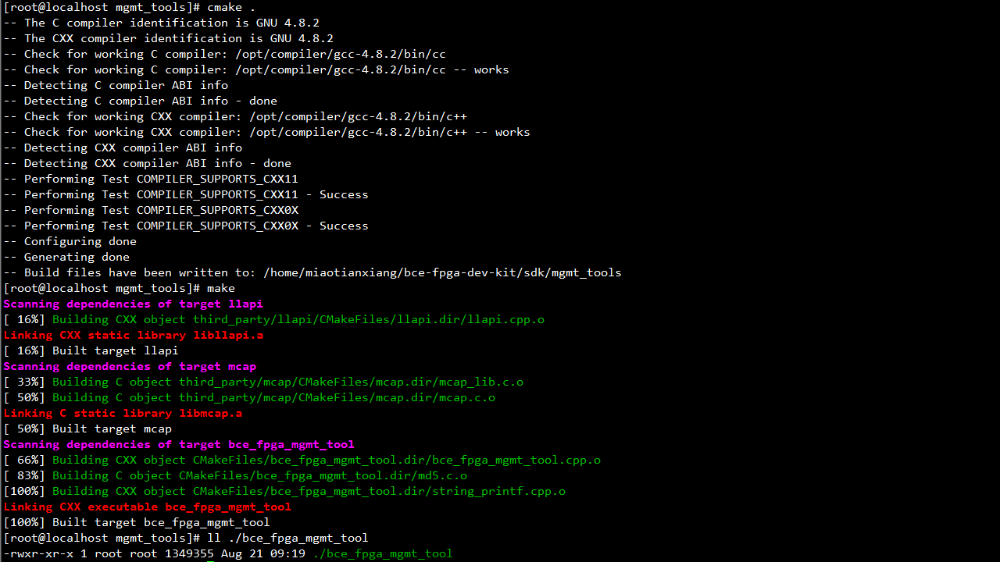
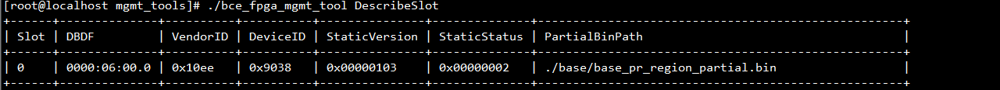
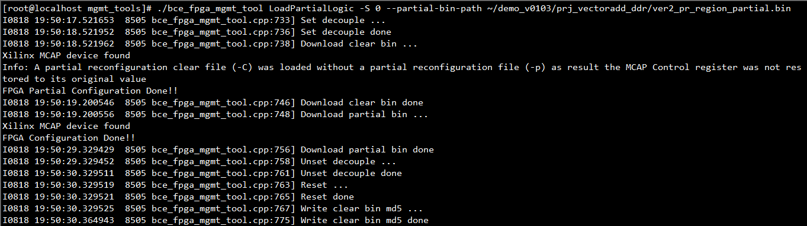
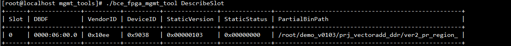
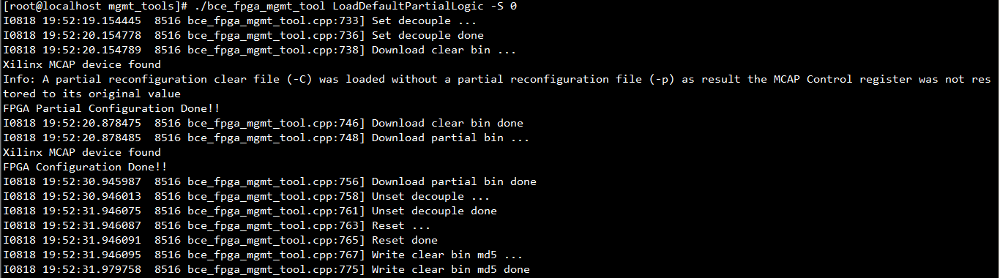

# 如何在百度云FPGA开发环境中使用bce_fpga_mgmt_tool

## 简介

`bce_fpga_mgmt_tool`是一个在百度云FPGA开发环境中使用的实用命令行工具，提供了诸如查看FPGA当前状态、更换动态逻辑、重置默认动态逻辑等一系列基础功能。它给开发者提供了简明易用的命令行接口，能显著降低FPGA使用难度、改善FPGA开发体验。 **每个子命令均支持`-h`选项，用户可以由此获取详细的参数信息和使用说明。**

**该工具现仍处于持续开发更新阶段，后续可能添加新功能或改动现有功能。下文说明如与程序自身`-h`帮助信息输出不符，请以后者为准。**

## 编译安装

* `bce_fpga_mgmt_tool`采用[cmake](https://cmake.org/)作为其构建系统，请确保虚拟机实例中已安装2.6版本以上的cmake。否则，请先执行`sudo yum -y install cmake`。
* `bce_fpga_mgmt_tool`应使用支持C++11标准的较新版本g++编译，直接使用虚拟机实例中yum源内的软件包即可。如未安装g++或其余编译工具链，请先执行`sudo yum -y install binutils gcc-c++ zlib-devel`。
* 在当前目录下执行`cmake .`，cmake构建系统会自动检查编译环境并生成Makefile。
* 在当前目录下执行`make`，如下图所示，命令结束后当前目录下产出`bce_fpga_mgmt_tool`可执行文件证明编译成功。

## 功能说明

### 查看FPGA当前状态 `bce_fpga_mgmt_tool DescribeSlot`

执行`bce_fpga_mgmt_tool DescribeSlot`，程序会打印出当前虚拟机实例中透传的所有FPGA板卡信息，如下图所示。若虚拟机实例中包含多块FPGA，则表格会有多行，每行描述一块FPGA。

该命令打印输出每一列的含义说明如下：

| 列名 | 说明 |
| ---- | ---- |
| **Slot**           | 当前FPGA的Slot#，从0开始赋予每块FPGA一个数字编号。后文`LoadPartialLogic`/`LoadDefaultPartialLogic`等子命令涉及到的`-S`选项请参考此列。 |
| **DBDF**           | 当前FPGA在虚拟机实例内的PCIe设备地址，形如Domain:Bus#:Device#.Function#。 |
| **VendorID**       | 当前FPGA的PCIe Vendor ID，默认为0x10ee，暂不支持自定义修改。 |
| **DeviceID**       | 当前FPGA的PCIe Device ID，默认为0x9038，暂不支持自定义修改。 |
| **StaticVersion**  | 当前FPGA静态逻辑的版本。 **FPGA静态逻辑不支持用户编程，且动态逻辑版本需与静态逻辑精确匹配。** 若百度云升级了静态逻辑，该列数值将随之递增。 |
| **StaticStatus**   | 当前FPGA静态逻辑的状态。若用户凭借`-S`指定了Slot#，后续输出会详细解释该列内容。 |
| **PartialBinPath** | 当前FPGA加载的动态逻辑路径。如为默认动态逻辑，则显示base。 |

`DescribeSlot`子命令亦支持`-S`选项，添加后，程序将输出用户指定Slot#对应FPGA的详细信息和部分性能数据。

`DescribeSlot`子命令支持的参数列表如下：

| 参数 | 说明 |
| ---- | ---- |
| **-S/--slot** | 如指定该选项，程序将输出用户指定Slot#对应FPGA的详细信息和部分性能数据。 |
| **-h/--help** | 打印该子命令的帮助信息 |
| **-V/--version** | 打印程序的版本信息 |

### 更换动态逻辑 `bce_fpga_mgmt_tool LoadPartialLogic`

执行`bce_fpga_mgmt_tool LoadPartialLogic`，程序会根据用户指定bin文件配置FPGA动态逻辑，如下图所示。该子命令中`-S`和`--partial-bin-path`是必需的两个参数，分别指定了待更换动态逻辑FPGA的Slot#以及动态逻辑bin文件的路径。

更换动态逻辑后，再次使用`DescribeSlot`子命令查看FPGA板卡状态如下，可见`StaticStatus`和`PartialBinPath`两列的内容发生了变化。

更换FPGA动态逻辑的简要流程如下：

* 检查用户通过`--partial-bin-path`参数给出的动态逻辑bin文件是否合法；
* 检查上一次更换动态逻辑时保存的last_clear_bin文件是否合法；
* 设置动静态逻辑间的隔离；
* 经由MCAP写入last_clear_bin文件；
* 经由MCAP写入动态逻辑bin文件；
* 解除动静态逻辑间的隔离；
* 按需对动静态逻辑进行RESET操作；
* 保存当前动态逻辑对应的clear_bin文件为last_clear_bin；

`LoadPartialLogic`子命令支持的参数列表如下：

| 参数 | 说明 |
| ---- | ---- |
| **-S/--slot** | 待操作FPGA的Slot# |
| **-P/--partial-bin-path** | 要写入动态逻辑bin文件的路径 |
| **-C/--partial-clear-bin-path** | 要写入动态逻辑对应clear_bin文件的路径。 **默认情况下，经tcl脚本编译生成的动态逻辑两个bin文件位于同级目录，无需指定该参数。** |
| **-f/--force** | 如指定该选项，则程序不对两个bin文件的文件名做规则检查。 |
| **-h/--help** | 打印该子命令的帮助信息 |
| **-V/--version** | 打印程序的版本信息 |

### 重置默认动态逻辑 `bce_fpga_mgmt_tool LoadDefaultPartialLogic`

执行`bce_fpga_mgmt_tool LoadDefaultPartialLogic`，程序会将FPGA动态逻辑重置为默认状态，如下图所示。该子命令效果等同于执行`bce_fpga_mgmt_tool LoadPartialLogic -S <x> --partial-bin-path=<path_to_default_partial_bin>`，这里不再赘述。

`LoadDefaultPartialLogic`子命令支持的参数列表如下：

| 参数 | 说明 |
| ---- | ---- |
| **-S/--slot** | 待操作FPGA的Slot# |
| **-h/--help** | 打印该子命令的帮助信息 |
| **-V/--version** | 打印程序的版本信息 |

### RESET动态逻辑 `bce_fpga_mgmt_tool ResetPartialLogic`

执行`bce_fpga_mgmt_tool ResetPartialLogic`，程序会对指定FPGA的动态逻辑做RESET操作。 **如遇FPGA当前动态逻辑工作异常，可于卸载驱动后尝试此操作。**

`ResetPartialLogic`子命令支持的参数列表如下：

| 参数 | 说明 |
| ---- | ---- |
| **-S/--slot** | 待操作FPGA的Slot# |
| **-h/--help** | 打印该子命令的帮助信息 |
| **-V/--version** | 打印程序的版本信息 |

### RESET静态逻辑 `bce_fpga_mgmt_tool ResetStaticLogic`

执行`bce_fpga_mgmt_tool ResetStaticLogic`，程序会对指定FPGA的静态逻辑做RESET操作。 **如遇FPGA当前动/静态逻辑工作异常，可于卸载驱动后尝试此操作。**

`ResetStaticLogic`子命令支持的参数列表如下：

| 参数 | 说明 |
| ---- | ---- |
| **-S/--slot** | 待操作FPGA的Slot# |
| **-h/--help** | 打印该子命令的帮助信息 |
| **-V/--version** | 打印程序的版本信息 |

## Q&A

* **Q: 为何`bce_fpga_mgmt_tool`需要以root权限运行？**
    * A: `bce_fpga_mgmt_tool`的正常工作依赖于读写透传后FPGA的PCIe配置空间或BAR空间，甚或访问内核pci_stub驱动暴露的一些sysfs文件，因此请以root权限运行该程序或于命令行首部添加`sudo`。

* **Q: 编译环节报错`/usr/bin/ld: cannot find -lz`应如何解决？**
    * A: 请在`make`前先执行`sudo yum -y install zlib-devel`从源中安装zlib编译环境。
